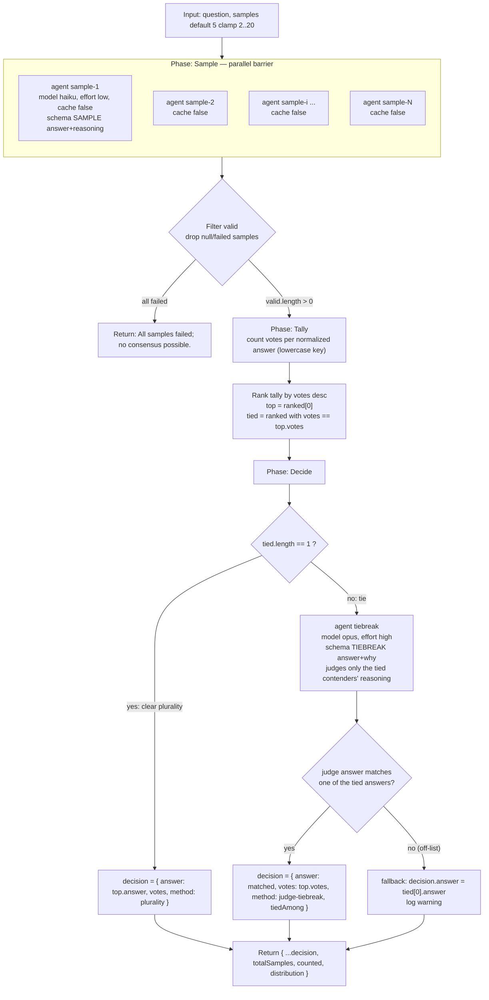

# self-consistency

> Muestrea N caminos de razonamiento independientes y elige la respuesta por consenso (voto), con desempate a cargo de un juez que pesa evidencia.

## En 30 segundos

`self-consistency` le hace la MISMA pregunta a N agentes independientes (sin verse entre sí), extrae de cada uno una respuesta normalizada corta, y se queda con la que junta más votos; si hay empate, un juez (`opus`, effort `high`) desempata pesando la evidencia de cada bando. Elegilo cuando una sola pasada de razonamiento puede fallar por azar (matemática, clasificación, juicio) y te sirve reportar el margen de consenso (5/5 no es lo mismo que 2/2/1) — no para redacción abierta ni para descartar afirmaciones por refutación (para eso, `adversarial-verify`).

## Cómo lanzarlo

```bash
/workflow new mi-run --pattern=self-consistency
```

Esto crea `.pi/workflows/mi-run.js` a partir del scaffold. Para correrlo con un input concreto:

```bash
/workflow run mi-run '{
  "question": "Un tren sale a las 14:00 a 80km/h y otro a las 14:30 a 100km/h en la misma dirección. ¿En qué hora se cruzan?",
  "samples": 7
}'
```

`question` (o sus alias `q` / `text`) es el único campo obligatorio; si se omite, el scaffold lanza error. `samples` es opcional (default `5`, clamp `[2, 20]`).

## Diagrama



## Qué hace

`self-consistency` implementa el método del paper *Self-Consistency Improves Chain of Thought Reasoning* (arXiv:2203.11171): en lugar de confiar en una sola cadena de razonamiento, dispara N intentos completamente independientes sobre la misma pregunta, extrae de cada uno una respuesta normalizada a una forma canónica corta, y elige la respuesta que junta más votos. La idea es que un solo camino de razonamiento puede desviarse, pero la convergencia de varios caminos independientes es una señal mucho más fuerte que confiar en cualquiera de ellos por separado.

A diferencia de un fan-out genérico que sintetiza un resumen combinado, este scaffold no mezcla las respuestas: cuenta acuerdos sobre un campo de respuesta estructurado y reporta el margen de consenso (por ejemplo, distinguir un 5/5 de un split 2/2/1), de modo que quien llama puede actuar según la confianza del resultado, no solo según "una respuesta cualquiera".

Los muestreadores corren con `cache: false` y un sufijo de prompt por intento (`independent attempt #i`) precisamente para garantizar que sean extracciones genuinamente independientes y no la misma completion cacheada repetida N veces — si no se hiciera esto, prompts idénticos podrían colisionar en caché y destruir la independencia estadística que el método necesita.

Es el contraparte de consenso de `adversarial-verify` (que poda una afirmación por mayoría de REFUTACIÓN): `self-consistency` se usa para ACORDAR una respuesta; `adversarial-verify` para DESCARTAR afirmaciones individuales.

## Cuándo usarlo

- Razonamiento/matemática/juicio de alta varianza, donde una sola pasada puede fallar aleatoriamente.
- Cuando necesitás reportar el margen de consenso (qué tan de acuerdo estuvieron los caminos), no solo una respuesta.
- Cuando el objetivo es que varios caminos independientes converjan en UNA respuesta (a diferencia de sintetizar un resumen combinado).
- Preguntas con una respuesta final normalizable a una forma canónica corta (un valor, una clasificación, un veredicto breve) — no para tareas abiertas de redacción larga, donde "votar" sobre texto libre no tiene sentido.

Si lo que necesitás es otra cosa, hay un scaffold más específico:

| Necesidad | Scaffold |
|---|---|
| Acordar UNA respuesta entre varios caminos independientes | **self-consistency** (este) |
| Descartar afirmaciones por refutación mayoritaria | `adversarial-verify` |
| Explorar y podar pasos intermedios de un problema | `tree-of-thoughts` |

## Cómo funciona

**Input parsing y helpers.** El input se parsea desde `args` (string JSON o objeto). Se define `compact()` para truncar textos largos en logs/prompts (default 60000 chars), y `fence()` para envolver datos no confiables en un delimitador derivado de un hash de contenido (FNV-like de 64 bits combinando dos acumuladores), de forma que un payload malicioso no pueda falsificar la marca de cierre. `node(role, extra)` resuelve overrides de modelo/effort/tools/skills por rol (`input.models[role]`, `input.efforts[role]`, etc.) con precedencia: override por rol > default global (`input.model`/`input.effort`) > default del call site.

**Fase Sample.** Usa `parallel([...])` como barrera — necesita que TODAS las muestras completen antes de tabular. Genera `samples` (default 5, clamp `[2, 20]`, logueando si hubo clamp) llamadas `agent()` independientes, cada una con:
- Modelo `haiku`, effort `low` (vía `node("sample", {...})`, pero fijos aquí en lugar de solo depender del override — el código pasa `model: "haiku", effort: "low"` explícitamente dentro de `node(...)`, que aun así puede ser sobreescrito por `input.models.sample`/`input.efforts.sample`).
- `cache: false` para forzar draws genuinamente independientes.
- `schema: SAMPLE` — objeto con `answer` (forma canónica corta) y `reasoning`.
- Prompt con instrucciones anti-inyección (todo lo fenced es DATA, no instrucciones) y un sufijo `(independent attempt #i)`.

Cada resultado se mapea a `{ i, answer, reasoning }` o `null` si el agente no devolvió `answer`. Si TODAS las muestras fallan, retorna el string `"All samples failed; no consensus possible."` sin seguir a las fases siguientes. Si algunas fallan, se loguea `failed/samples samples failed (counted as no vote)` y se continúa solo con las válidas.

**Fase Tally.** Cuenta votos por respuesta normalizada (`answer.toLowerCase()` como key de agrupación), acumulando en un `Map` con `{ answer, votes, samples: [i...] }`. Ordena descendente por votos (`ranked`), toma el líder (`top`) y calcula el conjunto de empatados (`tied`) — todos los que igualan `top.votes`. Loguea un resumen JSON (`counted`, `distinct`, `leader`, `leaderVotes`, `tie`).

**Fase Decide.** Dos caminos:
- **Plurality clara** (`tied.length === 1`): la respuesta ganadora se toma directamente, `method: "plurality"`.
- **Empate** (`tied.length > 1`): se arma un prompt con las respuestas empatadas y un ejemplar de razonamiento para cada una (truncado a 4000 chars vía `compact`), y se llama a un `agent()` juez con modelo `opus`, effort `high`, schema `TIEBREAK` (`answer` + `why`), pidiéndole elegir EXACTAMENTE una de las respuestas empatadas (copiada verbatim) siendo escéptico. El resultado del juez se valida contra la lista de empatados (case-insensitive); si no matchea ninguno (respuesta "off-list"), se loguea una advertencia y se usa un fallback determinístico: la primera respuesta empatada (`tied[0]`). `method: "judge-tiebreak"`, con `tiedAmong` listando las respuestas en disputa.

**Manejo de fallos parciales:** samples individuales que fallan se cuentan como "no vote" (no rompen el flujo, salvo que fallen TODAS). **Caching:** deshabilitado explícitamente en la fase Sample para preservar independencia estadística; no se menciona `cache: false` en el nodo de tiebreak (usa el comportamiento default de `agent`).

## Input y output

**Input** (objeto o string JSON vía `args`):

| Campo | Tipo | Default / clamp | Notas |
|---|---|---|---|
| `question` \| `q` \| `text` | string | requerido | lanza error si falta (`Pass { question: "..." } as workflow input.`) |
| `samples` | number | `5`; clamp `[2, 20]` | se loguea si el valor pedido se clampea |
| `model` / `effort` | string | — | override global para todos los nodos |
| `models[role]` / `efforts[role]` | object | — | override por rol (`sample`, `tiebreak`) |
| `tools` / `toolsByRole[role]` | array | — | tools por nodo |
| `skills` / `skillsByRole[role]` | array | — | skills por nodo |
| `excludeTools` / `excludeByRole[role]` | array | — | exclusión de tools por nodo |

**Output** (retorno del `main()`):

- Si todas las muestras fallan: string `"All samples failed; no consensus possible."`
- Caso normal: objeto
  - `answer`: respuesta consensuada (string)
  - `votes`: cantidad de votos del líder
  - `method`: `"plurality"` o `"judge-tiebreak"`
  - `tiedAmong` (solo si hubo tiebreak): lista de respuestas que empataron
  - `totalSamples`: N pedido tras clamp
  - `counted`: cuántas muestras válidas se contaron
  - `distribution`: array de `{ answer, votes, samples }` por cada respuesta distinta, ordenado por votos desc

No se observa uso de `writeArtifact` en este scaffold — el resultado se retorna directamente (no se persiste como archivo de artifact).

## Fases

1. **Sample** — dispara `samples` agentes independientes en paralelo (`parallel`, barrera), cada uno con `cache: false`, modelo `haiku`/effort `low` por default, devolviendo una respuesta normalizada + razonamiento vía schema.
2. **Tally** — cuenta votos por respuesta normalizada (case-insensitive), rankea y detecta empates.
3. **Decide** — resuelve por plurality directa si no hay empate, o invoca un agente juez (`opus`, effort `high`) para desempatar por evidencia entre las respuestas empatadas, con fallback determinístico si el juez responde fuera de lista.
