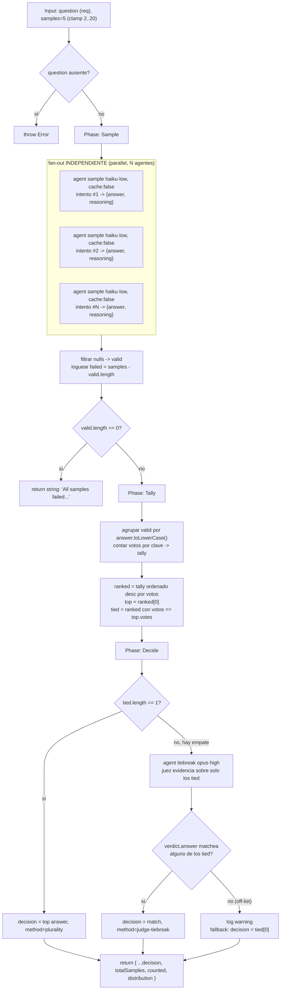

# self-consistency

> Muestrea N caminos de razonamiento independientes y elige la respuesta por consenso (voto), no por un único camino (arXiv:2203.11171).

## En 30 segundos

Un solo chain-of-thought puede equivocarse; si en cambio hacés que N modelos razonen el mismo problema **sin verse entre sí** y todos convergen en la misma respuesta, esa coincidencia es una señal mucho más fuerte que cualquier camino individual. Elegí este patrón para preguntas de alta varianza (matemática, lógica, juicio) donde querés medir el margen de consenso, no una respuesta única sin contexto de confianza.

## Cómo lanzarlo

```text
/workflow new mi-run --pattern=self-consistency
/workflow run mi-run {"question":"Does this code path leak the handle?","samples":7}
```

`question` (alias `q`/`text`) es el único campo obligatorio. `samples` es opcional (default 5, clamp 2..20).

## Diagrama



## Qué hace

`self-consistency` implementa el patrón del paper homónimo (Wang et al., arXiv:2203.11171): en vez de confiar en un único chain-of-thought, dispara `samples` (default 5) intentos de razonamiento totalmente independientes sobre la misma pregunta, cada uno con `cache:false` y un sufijo de prompt distinto (`intento #i`) para forzar muestras genuinas y no la misma respuesta cacheada repetida N veces. Cada sampler devuelve una respuesta normalizada a forma canónica corta más su razonamiento.

La diferencia frente a un fan-out-and-synthesize plano es que acá no se sintetiza un resumen mezclado: se **cuentan votos** sobre un campo de respuesta estructurado y se reporta el margen de consenso, de modo que un 5/5 y un 2/2/1 quedan distinguibles y el llamador puede actuar según esa confianza. Los empates no se rompen arbitrariamente: se delega a un juez de mayor capacidad que pesa evidencia solo entre las respuestas empatadas.

Es el contraparte "de consenso" de `adversarial-verify` (que poda una afirmación por mayoría de REFUTACIÓN): `self-consistency` se usa para **acordar** una respuesta, `adversarial-verify` para **refutar** afirmaciones individuales.

## Cuándo usarlo

- Razonamiento/matemática/juicio de alta varianza donde un solo intento puede fallar.
- Reportar el margen de consenso (cuántos de N coincidieron), no solo una respuesta.
- Acordar una única respuesta a través de múltiples caminos de razonamiento independientes.
- **No usarlo** cuando la tarea no tiene una "respuesta" normalizable a texto corto (p. ej. generar un documento largo o código): ahí conviene `fan-out-and-synthesize` u otro patrón de síntesis.
- **No usarlo** para refutar/verificar una afirmación puntual: para eso está `adversarial-verify`.

## Cómo funciona

**Validación de entrada.** `question` (o sus alias `q`/`text`) es obligatorio; si falta, lanza `Error` directamente (único scaffold de los revisados que no hace "abort gracioso" acá, sino throw). `samples` se sanea a entero y se clampea a `[2, 20]`, logueando si el valor pedido fue recortado.

**Fase Sample.** Lanza `samples` llamadas a `agent` en `parallel`, todas en el rol `sample` (modelo `haiku`, effort `low` — barato porque el volumen es lo que aporta señal, no la potencia de cada intento individual). Cada prompt: (a) pide razonar paso a paso y dar una respuesta final, (b) incluye las salvaguardas anti-inyección estándar sobre el contenido fenced de la pregunta (`fence("topic", question)`, delimitador derivado de un hash del contenido), (c) pide normalizar la respuesta a forma canónica corta (minúsculas, sin palabras de más) para que respuestas equivalentes matcheen como strings idénticos, y (d) agrega `(intento independiente #i — razoná por tu cuenta; no asumas una respuesta particular)` para evitar que el modelo ancle en una respuesta esperada. Cada agente corre con `cache:false` explícito — sin esto, prompts casi idénticos podrían resolverse contra la misma respuesta cacheada y arruinar la independencia estadística de las muestras. El schema de salida (`SAMPLE`) exige `answer` y `reasoning`. Tras el fan-out, se filtran los `null` (fallos bajo el patrón settle-por-`.then`) quedando `valid`; si `valid.length === 0`, retorna directamente el string `"All samples failed; no consensus possible."` sin pasar a Tally/Decide.

**Fase Tally.** Agrupa las respuestas válidas por su clave en minúsculas (case-insensitive) en un `Map`, acumulando votos y los índices de muestra que contribuyeron a cada respuesta. Ordena las claves por votos descendente (`ranked`); `top` es la de más votos, `tied` es el subconjunto de `ranked` que empata con `top` en cantidad de votos. Se loguea un resumen (`counted`, `distinct`, `leader`, `leaderVotes`, `tie`).

**Fase Decide.** Si hay un único ganador (`tied.length === 1`), la decisión es esa respuesta con `method: "plurality"` — no hace falta juez. Si hay empate, arma un prompt con la evidencia (razonamiento truncado a 4000 chars) de un ejemplar por cada respuesta empatada y llama a un `agent` en el rol `tiebreak` (modelo `opus`, effort `high` — el único punto del flujo donde se invierte capacidad alta, porque acá sí hace falta juicio fino) pidiéndole elegir exactamente una de las respuestas empatadas, copiada verbatim. La respuesta del juez se valida contra la lista cerrada de `tied`: si no matchea ninguna (respuesta "off-list"), se loguea una advertencia y se hace fallback a `tied[0]` en vez de confiar ciegamente en el output del juez.

**Manejo de fallos parciales:** cada muestra fallida en el fan-out se descarta silenciosamente vía `.then(...)` devolviendo `null` y filtrando después (equivalente a `settle`), y el conteo de fallos se loguea explícitamente (`failed/samples samples failed`) — nunca se propaga la excepción de una muestra individual.

**Caching:** deliberadamente **desactivado** (`cache: false`) en la fase Sample, justamente porque la independencia estadística de las N muestras es el mecanismo central del patrón; el tiebreak (una sola llamada) no necesita esa consideración.

## Input y output

| Campo | Tipo | Requerido | Default / clamp |
|---|---|---|---|
| `question` (alias `q`, `text`) | string | **sí** | — (si falta, `throw new Error`) |
| `samples` | number | no | default 5, clamp 2..20 |
| `model` / `effort` | string | no | override global para todo nodo |
| `models[role]` / `efforts[role]` | object | no | override por rol (`sample`, `tiebreak`); precedencia: por-rol > global > default del call-site |
| `tools` / `skills` / `excludeTools` (y variantes `*ByRole`) | array | no | pasados al `agent` si son arrays |

**Output:**

- Camino de fallo total: string `"All samples failed; no consensus possible."`
- Camino normal: `{ answer, votes, method, totalSamples, counted, distribution, tiedAmong? }`
  - `answer`: respuesta consensuada final.
  - `votes`: votos que obtuvo `top` (la respuesta líder original, incluso si el tiebreak eligió otra de las empatadas).
  - `method`: `"plurality"` o `"judge-tiebreak"`.
  - `tiedAmong`: presente solo si hubo empate; lista de las respuestas que compitieron.
  - `totalSamples`: cuántas muestras se pidieron (tras el clamp).
  - `counted`: cuántas muestras produjeron respuesta válida.
  - `distribution`: `[{ answer, votes, samples }]` por cada respuesta distinta observada, con los índices de muestra que la votaron.

No se observan llamadas a `writeArtifact` en este scaffold: toda la observabilidad pasa por `log(...)` (clamp de samples, fallos parciales, resumen de tally, veredicto de consenso) y por el shape de retorno.

## Fases

1. **Sample** — `samples` agentes independientes (haiku·low, `cache:false`) razonan la misma pregunta por separado y devuelven `{answer normalizada, reasoning}`; se filtran los fallos.
2. **Tally** — cuenta votos por respuesta normalizada (case-insensitive) y ordena por popularidad, detectando empates.
3. **Decide** — gana por pluralidad si no hay empate; si lo hay, un juez (opus·high) pesa la evidencia y elige entre las empatadas, con fallback seguro si responde fuera de lista.
