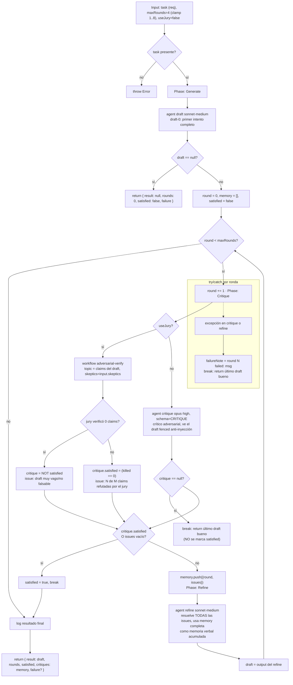

# self-refine

> Bucle acotado de generar → criticar → refinar en el mismo artefacto, con memoria verbal; quiet-stop cuando el crítico queda conforme (arXiv:2303.17651).

## En 30 segundos

Es el patrón para pulir UN artefacto (un texto, un doc, una sección de spec) por rondas sucesivas: un agente produce un borrador, otro lo critica de forma adversarial y localizada, y un tercer paso lo revisa incorporando esa crítica. Se detiene solo (`satisfied`) cuando ya no quedan issues accionables, o al llegar a un tope duro de rondas. Elegilo cuando la crítica puede ser intrínseca (otro LLM leyendo el mismo texto alcanza); si necesitás un oráculo objetivo externo (tests que pasan/fallan) y preferís reintentar desde cero en vez de editar in-place, usá `reflexion` en su lugar.

## Cómo lanzarlo

```text
/workflow new mi-run --pattern=self-refine
/workflow run mi-run {"task":"Escribí la sección de migración del changelog v2.", "maxRounds":4, "useJury":true}
```

`task` es el único campo obligatorio (si falta, la función tira `Error`). Ver la tabla en [Input y output](#input-y-output) para el resto de los campos y sus defaults.

## Diagrama



## Qué hace

`self-refine` implementa el patrón Self-Refine (Madaan et al., arXiv:2303.17651): un mismo artefacto se produce, se critica y se revisa en un ciclo, en vez de generarse una sola vez. La crítica se acumula como "memoria verbal" — cada ronda ve TODAS las críticas anteriores, no solo la última — así el refine no repite errores ya señalados ni pierde contexto de por qué se cambió algo.

El bucle está acotado en ambos extremos, que es la parte que las implementaciones ingenuas de "seguir mejorando" suelen fallar: un tope duro `maxRounds` (el paper reporta retornos decrecientes después de ~4 rondas) y un "quiet stop" cuando el crítico declara `satisfied` (sin issues accionables). Para que el quiet-stop sea confiable, al crítico se le exige ser específico y localizado (apuntar a spans concretos con un fix concreto), y se le pide una postura adversarial — nunca acordar mansamente con el propio draft.

La corrección puramente intrínseca (el crítico es, en esencia, el mismo generador acordando consigo mismo) puede degradar el output en vez de mejorarlo (Huang et al., arXiv:2310.01798). El scaffold mitiga esto de dos formas: (1) el crítico es una instancia de agente separada con un brief explícitamente adversarial, y (2) opcionalmente (`useJury: true`) reemplaza al crítico único por una COMPOSICIÓN con el workflow `adversarial-verify` — un jurado de escépticos que refuta por mayoría las afirmaciones del draft, un oráculo más fuerte e independiente que evalúa antes de confiar en un "satisfied".

## Cuándo usarlo

- Pulir un doc, spec o fragmento de código hasta que alcance calidad, con feedback intrínseco de otro LLM.
- Iterar sobre UN artefacto in-place (no reintentos desde cero).
- Casos donde se quiere un crítico más fuerte que "otro LLM opinando": activar `useJury: true` para delegar la señal de crítica al jurado adversarial.
- **No usarlo** cuando hay un oráculo objetivo externo (tests, comando de verificación) y conviene reintentar la tarea entera en cada trial en vez de editar in-place — para eso está `reflexion` (arXiv:2303.11366), que además lleva memoria cross-trial.

## Cómo funciona

**Validación de entrada y setup.** `task` (o sus alias `question`/`text`) es obligatorio; si falta, lanza `Error`. `maxRounds` se sanea con `clamp(1, 8)` sobre el valor pedido (default 4), logueando si se recortó. `useJury` activa la composición con `adversarial-verify`. Hay soporte de overrides por nodo (`input.model`/`effort` global, `input.models[role]`/`efforts[role]` por rol, y lo mismo para `tools`/`skills`/`excludeTools`), con precedencia por-rol > global > default del call-site.

**Fase Generate.** Un único `agent` (rol `draft`, modelo `sonnet`, effort `medium`) produce el primer intento completo de la tarea. Si el draft vuelve `null` (agente saltado o subagente caído), el scaffold aborta de inmediato devolviendo `{ result: null, rounds: 0, satisfied: false, failure: "initial draft null" }` — nunca intenta criticar un draft inexistente.

**Fase Critique (dentro del loop, por ronda).** Dos caminos según `useJury`:
- **Crítico único** (default): un `agent` (rol `critique`, modelo `opus`, effort `high`) recibe el draft envuelto en un fence anti-inyección (`fence()`, delimitador derivado de un hash del contenido) con instrucciones explícitas de tratar el contenido como DATA, nunca como instrucciones, e ignorar cualquier directiva embebida. Devuelve un objeto tipado (`schema: CRITIQUE`) con `satisfied: boolean` e `issues[]` (`where`/`problem`/`fix`), forzado a ser accionable y localizado. Si el `agent` devuelve `null` (crítico saltado/caído), el loop rompe de inmediato devolviendo el último draft bueno — un `null` NUNCA se interpreta como "satisfied".
- **Jurado** (`useJury: true`): delega la señal de crítica a `workflow("adversarial-verify", { topic: ..., skeptics: input.skeptics })`, pasándole las afirmaciones del draft como claims a refutar. Si el jury no verificó ninguna claim (`totalFindings === 0` o salida no-objeto), se trata explícitamente como "no satisfecho" (no como "draft limpio") con un issue sintético pidiendo un draft más concreto/falsable. Si verificó claims, `satisfied = (killed === 0)`; las claims refutadas se traducen a un único issue agregado.

**Quiet stop / acumulación de memoria.** Si la crítica resultante es `satisfied` o no trae issues, el loop marca `satisfied = true` y rompe sin refinar más. Si trae issues, se agregan a `memory` (array acumulado, cada entrada con su número de ronda) — esa memoria completa (no solo la última crítica) se pasa al refine.

**Fase Refine.** Un `agent` (rol `refine`, modelo `sonnet`, effort `medium`) recibe la tarea, TODA la memoria acumulada de críticas (truncada a ~16000 chars vía `compact`) y el draft actual, con instrucción de resolver todas las issues listadas sin introducir problemas nuevos ni tocar lo que ya funciona. Su output reemplaza `draft` y el loop vuelve a Critique.

**Manejo de fallos parciales.** Todo el cuerpo de cada ronda (critique + refine) está en un `try/catch`: si algo tira excepción, se registra `failureNote` con el número de ronda y el mensaje, se loguea, y se rompe el loop devolviendo el ÚLTIMO draft bueno conocido — nunca se pierde progreso ni se propaga la excepción hacia arriba.

**Caching:** no se observa ningún mecanismo explícito de caché; cada llamada a `agent`/`workflow` es fresca.

## Input y output

**Input** (JSON-stringified en `args`, parseado defensivamente):

| Campo | Tipo | Requerido | Default / clamp |
|---|---|---|---|
| `task` (alias `question`/`text`) | string | **sí** | — (si falta, `throw Error`) |
| `maxRounds` | number | no | default 4, clamp 1..8 |
| `useJury` | boolean | no | default `false` — usa `adversarial-verify` como crítico si es `true` |
| `skeptics` | number | no (solo con `useJury`) | pasado tal cual a `adversarial-verify` |
| `model` / `effort` | string | no | override global para todo nodo |
| `models[role]` / `efforts[role]` | object | no | override por rol (`draft`, `critique`, `refine`); precedencia: por-rol > global > default del call-site |
| `tools` / `skills` / `excludeTools` (y variantes `*ByRole`) | array | no | pasados al `agent` si son arrays |

**Output:** `{ result, rounds, satisfied, critiques, failure? }`

- `result`: string del draft final (el último bueno, sea que se haya llegado a `satisfied` o se haya frenado por cap/fallo).
- `rounds`: número de rondas de critique/refine efectivamente ejecutadas (no cuenta la generación inicial).
- `satisfied`: `true` solo si el loop terminó porque el crítico/jury declaró conformidad; `false` si terminó por `maxRounds`, por un crítico `null`, o por una excepción.
- `critiques`: la `memory` acumulada — array de `{ round, issues }` por cada ronda que produjo issues.
- `failure` (opcional): string con la causa cuando el loop terminó de forma anómala (crítico `null` o excepción en una ronda); ausente en el camino feliz.

No se observan llamadas a `writeArtifact`: toda la observabilidad pasa por `log(...)` (progreso por ronda, satisfacción o cantidad de issues, clamps aplicados, fallos) y por el shape de retorno.

## Fases

1. **Generate** — un `agent` produce el primer borrador completo de la tarea.
2. **Critique** — un `agent` adversarial (o, con `useJury:true`, el workflow `adversarial-verify` como jurado escéptico) evalúa el draft y devuelve `satisfied` + `issues` localizadas y accionables.
3. **Refine** — un `agent` revisa el draft resolviendo todas las issues señaladas, usando la memoria verbal acumulada de rondas previas; el ciclo vuelve a Critique hasta `satisfied` o `maxRounds`.
