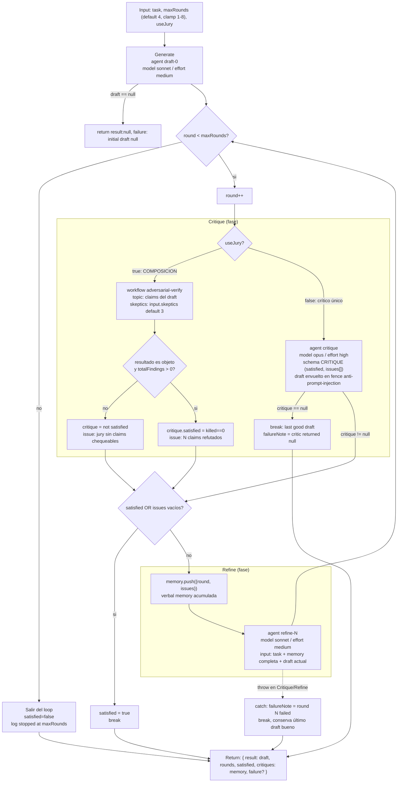

# self-refine

> Loop acotado de generar → criticar → refinar en el mismo lugar, con memoria verbal; se detiene silenciosamente cuando el crítico queda satisfecho.

## En 30 segundos

Es un pulidor iterativo para UN artefacto: un agente escribe un primer borrador, otro (más exigente) lo critica de forma adversarial y localizada, y un tercero lo revisa aplicando esas críticas — repitiendo hasta que el crítico quede conforme o se agote `maxRounds`. Elegilo para pulir un documento, spec o snippet de código donde la crítica intrínseca del modelo alcanza; si necesitás reintentar la tarea completa desde cero en cada trial, o un oráculo objetivo pass/fail, usá `reflexion` en su lugar.

## Cómo lanzarlo

```text
/workflow new mi-run --pattern=self-refine
/workflow run mi-run {"task": "Escribí una sección de troubleshooting para el README de este proyecto", "maxRounds": 3, "useJury": false}
```

`task` (alias `question`/`text`) es el único campo obligatorio; `maxRounds` (default `4`, clamp `[1,8]`) y `useJury` (default `false`) son opcionales. Ver [Input y output](#input-y-output) para overrides opcionales (`model`, `models`, `tools`, `skeptics`, etc.).

## Diagrama



## Qué hace

`self-refine` implementa el patrón Self-Refine (arXiv:2303.17651): produce un primer borrador y luego lo mejora **en el mismo lugar** mediante rondas de crítica y revisión, en vez de reintentar la tarea desde cero. Cada ronda de crítica es adversarial y debe ser accionable y localizada (apunta a un span concreto y sugiere un fix concreto); las críticas de todas las rondas anteriores se acumulan como "memoria verbal" y se anteponen al prompt de la siguiente refinación, para que el modelo no repita errores ya señalados.

El loop está acotado por ambos extremos: un tope duro `maxRounds` (por defecto 4, clamp entre 1 y 8 — el paper original nota que el retorno decae rápido después de ~4 rondas) y una parada silenciosa cuando el crítico declara `satisfied=true` (o no reporta issues). Esto evita tanto el loop infinito como el sobre-ajuste de "seguir mejorando" sin criterio.

Para mitigar el problema conocido de que la auto-crítica intrínseca puede degradar la salida cuando el crítico es esencialmente el mismo generador validándose a sí mismo (Huang et al., arXiv:2310.01798), el scaffold aplica dos mitigaciones: (1) el crítico por defecto es una instancia de agente separada con un brief explícitamente adversarial (`model: opus`, `effort: high`) que nunca reescribe, solo critica; y (2) opcionalmente (`useJury:true`) reemplaza ese crítico único por una composición con el workflow `adversarial-verify`, un jurado de escépticos que refuta por mayoría las afirmaciones del borrador — una señal más fuerte e independiente antes de aceptar "satisfied".

El manejo de fallos parciales es explícito: si el draft inicial vuelve `null`, retorna de inmediato sin intentar refinar nada; si el crítico (modo agente único) retorna `null`, o si cualquier excepción ocurre durante crítica/refinamiento, el loop rompe conservando el **último draft bueno conocido** en vez de descartarlo, y deja constancia en `failure`.

## Cuándo usarlo

- Pulir un único artefacto (documento, spec, sección de código) donde la crítica puede ser intrínseca al modelo.
- Iterar hasta calidad sobre una sola pieza de contenido, no sobre múltiples archivos o un repo.
- Casos donde se quiere un crítico adicional más fuerte e independiente vía jurado escéptico (`useJury: true`).
- **No usarlo cuando**: conviene re-intentar la tarea completa desde un estado limpio en cada trial (usar `reflexion.js` en su lugar, que tiene reset de entorno y evaluador externo opcional vía `verifyCmd`); tampoco es apto cuando se necesita un oráculo objetivo pass/fail (tests, comandos) — para eso también aplica `reflexion`.

## Cómo funciona

1. **Parseo de input y helpers.** Lee `args` (string JSON u objeto), define `compact()` para truncar datos largos a 60000 chars antes de meterlos en prompts, y `fence()` para envolver datos no confiables (el draft) en un delimitador `<untrusted-HASH>` derivado de un hash del contenido — evita que un payload malicioso forje el marcador de cierre y por lo tanto neutraliza inyección de instrucciones dentro del draft que el crítico lee.

2. **Overrides por rol.** `node(role, extra)` resuelve `model`/`effort`/`tools`/`skills`/`excludeTools` con precedencia: override por rol (`input.models[role]`, etc.) > default global (`input.model`, etc.) > default del scaffold. Los roles usados son `draft`, `critique`, `refine`.

3. **Validación de input.** Requiere `task` (o `question`/`text` como alias). `maxRounds` se clampa a `[1, 8]` con log si se recorta. `useJury` es un booleano estricto (`=== true`).

4. **Fase Generate.** Un único `agent(...)` produce el primer borrador completo (`model: sonnet`, `effort: medium`, label `draft-0`). Si retorna `null` (subagente falló o fue saltado), el scaffold corta inmediatamente y devuelve `{ result: null, rounds: 0, satisfied: false, critiques: [], failure: "initial draft null" }`.

5. **Loop principal** (`while (round < maxRounds)`), envuelto en `try/catch` por ronda para aislar fallos parciales:
   - **Fase Critique.**
     - Si `useJury: true`: llama a `workflow("adversarial-verify", { topic, skeptics: input.skeptics ?? 3 })` (COMPOSICIÓN con otro scaffold). El resultado puede ser un string (cuando el finder no extrajo claims chequeables) — ese caso se trata explícitamente como "no verificado" (no como "draft limpio") para no quiet-stop falsamente. Si hay findings, `satisfied = (killed === 0)`; los claims refutados por mayoría se traducen a un issue sintético.
     - Si `useJury: false` (default): llama a un `agent(...)` crítico (`model: opus`, `effort: high`) con `schema: CRITIQUE` (JSON Schema tipado: `satisfied: boolean`, `issues: [{where, problem, fix}]`). El draft se pasa envuelto en `fence("candidate", ...)` con instrucciones explícitas de ignorar cualquier directiva incrustada en los datos. Si el agente retorna `null`, rompe el loop con `failureNote` y conserva el último draft.
   - **Gate de decisión.** Si `critique.satisfied` es true o no hay issues, marca `satisfied = true` y sale del loop (quiet stop).
   - Si hay issues, los agrega a `memory` (array acumulativo de `{round, issues}` — la memoria verbal).
   - **Fase Refine.** Un `agent(...)` (`model: sonnet`, `effort: medium`, label `refine-N`) recibe la tarea, **toda la memoria acumulada** (`compact(memory, 16000)`) y el draft actual, con instrucción de resolver todas las críticas sin introducir problemas nuevos. El resultado reemplaza `draft` y el loop vuelve a evaluar la condición de ronda.
   - Cualquier excepción durante crítica o refinamiento se captura: registra `failureNote`, loggea, y rompe el loop conservando el `draft` previo a la excepción (nunca lo descarta).

6. **Salida del loop.** Si se agotó `maxRounds` sin `satisfied`, loggea que se detuvo sin llegar a satisfacción. Loggea siempre un resumen final (`rounds`, `satisfied`, `useJury`, `failed`).

No hay caching explícito en este scaffold (cada ronda vuelve a llamar a los agentes); la única forma de "memoria" es la lista `memory` que se pasa completa en cada prompt de refinamiento.

## Input y output

**Input** (objeto o string JSON vía `args`):

| Campo | Tipo | Default / clamp | Notas |
|---|---|---|---|
| `task` (o `question`/`text`) | string | requerido | lanza error si falta |
| `maxRounds` | number | `4`, clamp `[1, 8]` | tope duro de rondas crítica+refine |
| `useJury` | boolean | `false` | debe ser literalmente `true` para activar el jurado |
| `skeptics` | number | `3` (solo si `useJury`) | pasado a `adversarial-verify` |
| `model` / `effort` | string | — | overrides globales aplicados a todos los nodos |
| `models[role]` / `efforts[role]` | object | — | overrides por rol: `draft`, `critique`, `refine` |
| `tools` / `toolsByRole[role]` | array | — | herramientas permitidas por nodo |
| `skills` / `skillsByRole[role]` | array | — | skills por nodo |
| `excludeTools` / `excludeByRole[role]` | array | — | herramientas excluidas por nodo |

**Output** (objeto retornado):

| Campo | Tipo | Descripción |
|---|---|---|
| `result` | any / null | el draft final (o `null` si la generación inicial falló) |
| `rounds` | number | rondas de crítica+refine ejecutadas |
| `satisfied` | boolean | true si el crítico dio quiet-stop |
| `critiques` | array | memoria verbal completa: `[{round, issues}]` |
| `failure` | string (opcional) | presente solo si hubo un fallo parcial (draft inicial null, crítico null, o excepción en una ronda) |

No se observan llamadas a `writeArtifact` en este scaffold — el resultado se retorna directamente, sin persistir artifacts en disco.

## Fases

1. **Generate** — produce el borrador inicial (`agent`, `draft-0`).
2. **Critique** — evalúa el borrador actual, ya sea con un crítico adversarial único o con el jurado `adversarial-verify` (`useJury: true`); determina si hay issues accionables o si se declara `satisfied`.
3. **Refine** — revisa el borrador aplicando los fixes señalados, usando toda la memoria verbal acumulada; se repite junto con Critique hasta `satisfied` o `maxRounds`.
