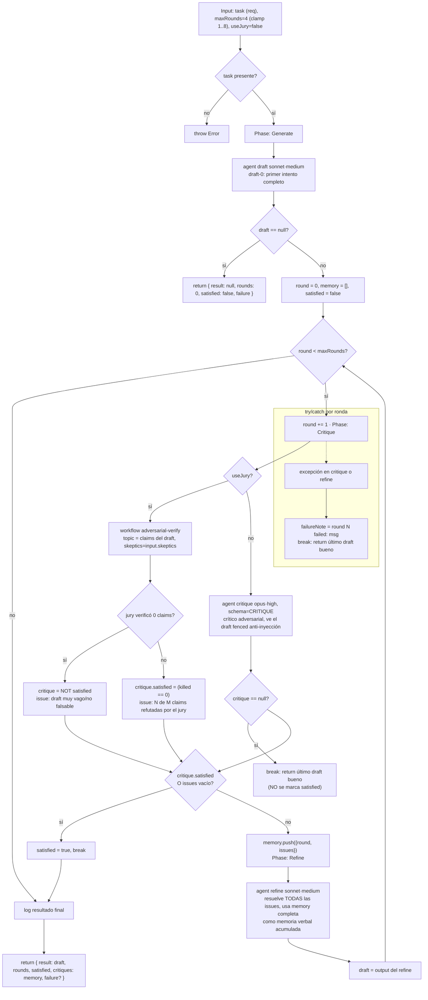

# self-refine

> Loop acotado de generar → criticar → refinar en el mismo artifact, con memoria verbal; quiet-stop cuando el crítico queda conforme (arXiv:2303.17651).

## En 30 segundos

Es un patrón para pulir un solo artifact (un texto, un doc o una sección de spec) por rondas: un agente genera un borrador, otro lo critica de forma adversarial y localizada, y un tercer paso incorpora esa crítica. El loop se corta por `satisfied`, cuando ya no queda nada accionable; por `maxRounds`, cuando se llega al tope; por `draft` inicial `null`; por `critique` `null`; o por una excepción. Usalo cuando la señal de mejora puede salir de otro LLM leyendo el mismo texto; si necesitás un oráculo externo y reintentos desde cero, elegí `reflexion`.

## Cómo lanzarlo

```text
/workflow new mi-run --pattern=self-refine
/workflow run mi-run {"task":"Escribí la sección de migración del changelog v2.", "maxRounds":4, "useJury":true}
```

`task` es el único campo obligatorio (si falta, la función tira `Error`). Ver la tabla en [Input y output](#input-y-output) para el resto de los campos y sus defaults.

## Diagrama



## Qué hace

`self-refine` implementa el patrón Self-Refine (Madaan et al., arXiv:2303.17651): un mismo artifact se produce, se critica y se revisa en un ciclo, en vez de generarse una sola vez. La crítica se acumula como "memoria verbal" — cada ronda ve TODAS las críticas anteriores, no solo la última — así el refine no repite errores ya señalados ni pierde contexto de por qué se cambió algo.

El loop está acotado en ambos extremos, que es la parte que las implementaciones ingenuas de "seguir mejorando" suelen fallar: un tope duro `maxRounds` (el paper reporta retornos decrecientes después de ~4 rondas) y un "quiet stop" cuando el crítico declara `satisfied` (sin issues accionables). Para que el quiet-stop sea confiable, al crítico se le exige ser específico y localizado (apuntar a spans concretos con un fix concreto), y se le pide una postura adversarial — nunca acordar mansamente con el propio draft.

La corrección puramente intrínseca (el crítico es, en esencia, el mismo generador acordando consigo mismo) puede degradar el output en vez de mejorarlo (Huang et al., arXiv:2310.01798). El scaffold mitiga esto de dos formas: (1) el crítico es una instancia de agente separada con un brief explícitamente adversarial, y (2) opcionalmente (`useJury: true`) reemplaza al crítico único por una COMPOSICIÓN con el workflow `adversarial-verify` — un jurado de escépticos que refuta por mayoría las afirmaciones del draft, un oráculo más fuerte e independiente que evalúa antes de confiar en un "satisfied".

## Cuándo usarlo

| Si querés... | Usá... |
|---|---|
| pulir un solo artifact in-place con crítica intrínseca | `self-refine` |
| reintentar la tarea completa en cada trial, con memoria cross-trial y un oráculo externo | `reflexion` |

- Activá `useJury: true` cuando quieras que la crítica venga de `adversarial-verify`, un jurado más duro que un solo crítico.
- No lo uses cuando ya tenés tests o un comando de verificación que te diga objetivamente si pasaste o no.

## Cómo funciona

- **Validación y setup.** `task` (o sus alias `question`/`text`) es obligatorio; si falta, lanza `Error`. `maxRounds` se sanea con `clamp(1, 8)` sobre el valor pedido (default 4); si se recorta, se registra en `log(...)`. `useJury` activa la composición con `adversarial-verify`. También hay overrides por nodo: `input.model`/`input.effort` globales, `input.models[role]`/`input.efforts[role]` por rol, y lo mismo para `tools`/`skills`/`excludeTools`; la precedencia es por-rol > global > default del call-site.

- **Generate.** Un único `agent` (rol `draft`, modelo `sonnet`, effort `medium`) produce el primer intento completo. Si devuelve `null`, el scaffold aborta con `{ result: null, rounds: 0, satisfied: false, failure: "initial draft null" }` y no intenta criticar un draft inexistente.

- **Critique.** Hay dos caminos. Con crítico único, un `agent` (rol `critique`, modelo `opus`, effort `high`) recibe el draft dentro de un fence anti-inyección derivado de un hash y devuelve `schema: CRITIQUE` con `satisfied` + `issues[]` localizadas y accionables; si ese `agent` devuelve `null`, el loop rompe y conserva el último draft bueno. Con `useJury: true`, `workflow("adversarial-verify", { topic, skeptics })` asume la crítica: si el jurado no puede verificar claims, se trata como “no satisfecho”; si sí puede, `satisfied = (killed === 0)` y las claims refutadas se condensan en un issue.

- **Quiet stop y memoria.** Si la crítica viene satisfecha o sin issues, el loop marca `satisfied = true` y corta. Si trae issues, se guardan en `memory` como `{ round, issues }`; esa memoria completa se pasa al refine.

- **Refine.** Un `agent` (rol `refine`, modelo `sonnet`, effort `medium`) recibe la tarea, la memoria completa truncada a ~16000 chars con `compact`, y el draft actual. Su trabajo es resolver todas las issues sin romper lo que ya funciona; su salida reemplaza `draft` y el loop vuelve a Critique.

- **Fallos parciales y caché.** Si critique o refine tiran una excepción, se registra `failureNote`, se loguea, y se retorna el último draft bueno. No se observa caché explícita: cada llamada a `agent`/`workflow` es fresca.

## Input y output

**Input** (JSON-stringified en `args`, parseado defensivamente):

| Campo | Tipo | Requerido | Default / clamp |
|---|---|---|---|
| `task` (alias `question`/`text`) | string | **sí** | — (si falta, `throw Error`) |
| `maxRounds` | number | no | default 4, clamp 1..8 |
| `useJury` | boolean | no | default `false` — usa `adversarial-verify` como crítico si es `true` |
| `skeptics` | number | no (solo con `useJury`) | default 3; se pasa tal cual a `adversarial-verify` |
| `model` / `effort` | string | no | override global para todo nodo |
| `models[role]` / `efforts[role]` | object | no | override por rol (`draft`, `critique`, `refine`); precedencia: por-rol > global > default del call-site |
| `tools` / `skills` / `excludeTools` (y variantes `*ByRole`) | array | no | pasados al `agent` si son arrays |

**Output:** `{ result, rounds, satisfied, critiques, failure? }`

- `result`: string del draft final (el último bueno, sea que se haya llegado a `satisfied` o se haya frenado por cap/fallo).
- `rounds`: número de rondas de critique/refine efectivamente ejecutadas (no cuenta la generación inicial).
- `satisfied`: `true` solo si el loop terminó porque el crítico/jury declaró conformidad; `false` si terminó por `maxRounds`, por un crítico `null`, o por una excepción.
- `critiques`: la `memory` acumulada — array de `{ round, issues }` por cada ronda que produjo issues.
- `failure` (opcional): string con la causa cuando el loop terminó de forma anómala (`initial draft null`, crítico `null` o excepción en una ronda); ausente en el camino feliz.

No se observan llamadas a `writeArtifact`: toda la observabilidad pasa por `log(...)` (progreso por ronda, satisfacción o cantidad de issues, clamps aplicados, fallos) y por el shape de retorno.

## Fases

1. **Generate** — un `agent` produce el primer borrador completo de la tarea.
2. **Critique** — un `agent` adversarial (o, con `useJury:true`, el workflow `adversarial-verify` como jurado escéptico) evalúa el draft y devuelve `satisfied` + `issues` localizadas y accionables.
3. **Refine** — un `agent` revisa el draft resolviendo todas las issues señaladas, usando la memoria verbal acumulada de rondas previas; el ciclo vuelve a Critique hasta `satisfied` o `maxRounds`.
