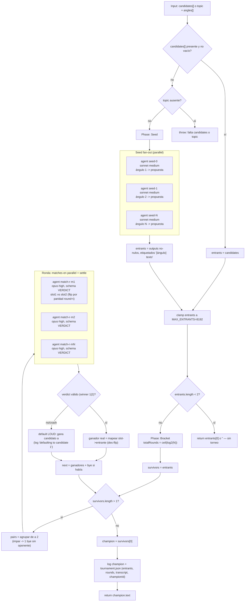

# tournament

> Torneo de eliminación simple: un juez compara candidatos de a pares y avanza solo el ganador, ronda tras ronda.

## En 30 segundos

Usá este scaffold cuando puntuar en absoluto (por ejemplo, dar un score de 1 a 10) sea poco confiable, pero comparar dos alternativas cara a cara sí sea estable. Un juez enfrenta candidatos de a pares y solo avanza el ganador, como en un bracket deportivo, hasta que queda un único campeón. Sirve para elegir el mejor borrador o diseño, o para un ranking comparativo cabeza a cabeza; si necesitás un score absoluto o consenso por votación, otro patrón encaja mejor.

## Cómo lanzarlo

```text
/workflow new mi-run --pattern=tournament
/workflow run mi-run {"candidates":["Propuesta A: microservicios", "Propuesta B: monolito modular", "Propuesta C: serverless", "Propuesta D: monolito clásico"]}
```

También podés arrancar solo con un `topic` y dejar que el scaffold genere los candidatos por vos, uno por ángulo:

```text
/workflow run mi-run {"topic":"¿Cómo deberíamos migrar el pipeline de facturación?", "angles":["risk-first","simplicity-first","user-first","cost-first"]}
```

`candidates` (array de strings) tiene prioridad; si falta o viene vacío, se requiere `topic`/`question`/`q`/`text` (el primero no-nulo gana) para generar un candidato por cada `angles` (default `["risk-first","simplicity-first","user-first","cost-first"]`).

## Diagrama



## Qué hace

`tournament` implementa un bracket clásico de eliminación simple (`single-elimination`): en lugar de pedirle al modelo un score absoluto para cada candidato, lo hace comparar de a pares y le exige un veredicto binario (`{ winner: 1|2, why }`). Solo avanza el ganador de cada match; la ronda se repite hasta que queda un único sobreviviente, el campeón.

Lo "dinámico" viene de que el bracket no está cerrado de antemano: si no se pasan `candidates`, el scaffold genera un entrante por cada ángulo de análisis en la Fase Seed antes de empezar. El número de rondas (`ceil(log2(N))`) surge del tamaño real del campo, y un campo impar recibe un `bye` (pase libre sin oponente inventado) en lugar de forzar un match artificial.

El diseño reduce dos sesgos típicos al usar LLMs como jueces: la posición en el prompt (se alterna quién ocupa el slot 1 según la paridad de `round + i`, para hacer `washout` del sesgo posicional) y el fallo silencioso (si un match crashea o devuelve un veredicto inválido, se registra explícitamente y se aplica un default declarado; nunca hay fallback mudo).

## Cuándo usarlo

- Elegir el mejor de varios borradores o diseños (`useWhen` del catálogo).
- Hacer ranking comparativo entre alternativas.
- Resolver una selección cabeza a cabeza.
- Usarlo cuando puntuar en absoluto es menos confiable que comparar dos opciones.

No lo uses cuando necesitás un score absoluto por candidato — ahí conviene un scaffold de puntuación directa; cuando lo importante es el consenso entre varios caminos de razonamiento sobre la misma pregunta — ahí `self-consistency` (votación) encaja mejor; o cuando querés resumir/consolidar un corpus en vez de comparar alternativas — ahí `map-reduce` o `fan-out-and-synthesize` son más apropiados.

## Cómo funciona

**Fase Seed.** Si `input.candidates` es un array no vacío (tras filtrar falsy), se usa tal cual como campo de entrantes. Si no, requiere `topic`/`question`/`q`/`text` (se toma el primero no-nulo); sin ninguno, lanza una excepción explícita. Con `topic`, genera un candidato por cada elemento de `angles` (default de 4 ángulos: `risk-first`, `simplicity-first`, `user-first`, `cost-first`, con clamp a 4096 por el límite de `parallel()`) lanzando un `agent` por ángulo en `parallel`, en el rol `seed` (`sonnet`, `medium`), cada uno con el topic envuelto en un fence anti-inyección derivado del hash del contenido. Los resultados nulos (fallo bajo `parallel`) se descartan sin mover las etiquetas originales de cada ángulo, para que un seed caído no corra las de los siguientes. El campo resultante se recorta a `MAX_ENTRANTS = 8192` (se loguea si aplica, para que cualquier ronda quede dentro del cap de 4096 thunks de `parallel()`). Si quedan menos de 2 entrantes, no hay torneo: retorna ese único candidato, o `""`.

**Fase Bracket.** `totalRounds = ceil(log2(N))` se calcula y se loguea al arrancar, solo como referencia: el loop real termina por condición, no por contador fijo. En cada ronda se agrupan los sobrevivientes de a pares; si el conteo es impar, el último recibe un `bye` y avanza sin jugar. Cada match lo resuelve un `agent` juez (`opus`, `high`, `schema: VERDICT` con `{winner: 1|2, why}`), y todos se lanzan en `parallel` para esa ronda (`settle`: un match caído no derrumba la ronda completa). Para bajar el sesgo de posición, el candidato que va en slot 1 versus slot 2 alterna según la paridad de `round + índice de match`; el label del `agent` (`match-r{round}-m{i}`) es estable entre rondas para no colisionar la caché de prompts. Después de cada match, el veredicto por slot se remapea al entrante real (deshaciendo el `flip`); si el veredicto es inválido o el match crasheó, se aplica un default explícito y logueado (gana el candidato `a`, nunca en silencio) y eso cuenta como `defaulted` en el log de la ronda. Los ganadores, más el `bye` si lo hubo, forman los `survivors` de la siguiente ronda; el loop sigue mientras `survivors.length > 1`.

**Personas/modelos:** rol `seed` en `sonnet`/`medium` (generación barata de propuestas); rol `match` en `opus`/`high` (juicio de mayor calidad, porque decide quién avanza). Los overrides por rol se aplican con `input.models[role]` / `input.efforts[role]` y con `input.toolsByRole` / `input.skillsByRole` / `input.excludeByRole`; la precedencia es por rol > global (`input.model` / `input.effort`) > default del call-site.

**Caching:** no hay una API de cache explícita; cada `agent` corre fresco, aunque los labels estables por ronda y match evitan colisiones si el runtime cachea por label.

## Input y output

| Campo | Tipo | Requerido | Default / clamp |
|---|---|---|---|
| `candidates` | string[] | uno de `candidates`\|`topic` (gana `candidates`) | — (se filtran valores falsy) |
| `topic` / `question` / `q` / `text` | string | uno de `candidates`\|`topic` | — (se toma el primero no-nulo si falta `candidates`) |
| `angles` | string[] | no | default `["risk-first","simplicity-first","user-first","cost-first"]`, clamp a 4096 elementos |
| `model` / `effort` | string | no | override global para todo nodo |
| `models[role]` / `efforts[role]` | object | no | override por rol (`seed`, `match`); precedencia: por-rol > global > default |
| `toolsByRole` / `skillsByRole` / `excludeByRole` | object | no | mapas por rol; si el valor resuelve a array, se pasa al `agent` |
| `tools` / `skills` / `excludeTools` | array | no | overrides globales pasados al `agent` si son arrays |

**Output:** el texto del candidato campeón (`champion.text`), o `""`/el único entrante si el campo tenía menos de 2 candidatos. No se observan llamadas a `writeArtifact`; toda la observabilidad pasa por `log(...)`: tamaño del bracket inicial, byes, conteo de defaults por ronda, y un resumen final `tournament.json` (compactado a 60000 chars) con `entrants`, `rounds`, el `transcript` completo de partidos (`round`, `match`, `a`, `b`, `winner`, `why`) y el `championId`.

## Fases

1. **Seed** — resuelve el campo de entrantes: usa `candidates` tal cual, o genera un candidato por cada ángulo vía `agent` en `parallel` (rol `seed`, sonnet·medium) a partir de `topic`; clamp a `MAX_ENTRANTS`.
2. **Bracket** — loop de rondas de eliminación simple: empareja sobrevivientes (con bye si el campo es impar), un `agent` juez por partido en `parallel` con settle y schema tipado (rol `match`, opus·high), washout de sesgo de posición, default explícito ante fallos, hasta que sobrevive un único campeón.
