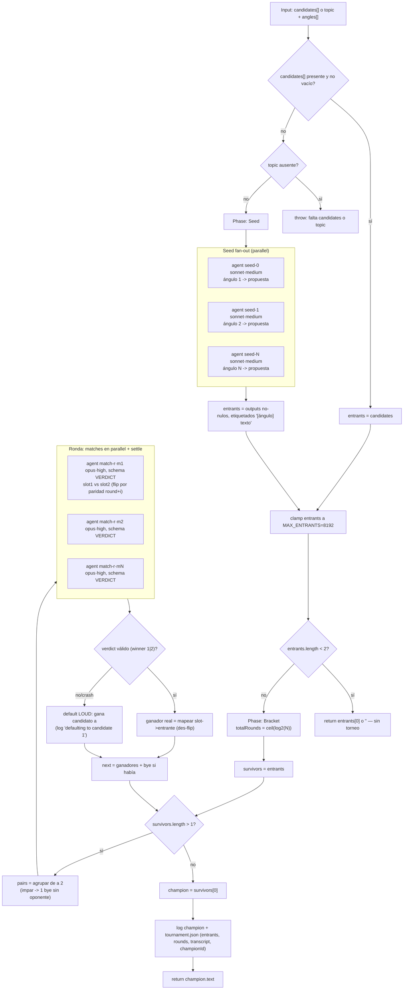

# tournament

> Bracket de eliminación simple: rondas de un juez por pareja hasta que sobrevive un solo candidato.

## En 30 segundos

Es el patrón para cuando puntuar en absoluto (dar un score de 1 a 10) es poco confiable, pero comparar dos alternativas cara a cara es fácil. Un juez arbitra partidos de a pares y solo el ganador avanza a la siguiente ronda, como un bracket de torneo deportivo, hasta que queda un único campeón. Elegilo para elegir el mejor de varios borradores/diseños o para un ranking comparativo cabeza a cabeza; si necesitás un score absoluto o consenso por votación, otro patrón encaja mejor.

## Cómo lanzarlo

```text
/workflow new mi-run --pattern=tournament
/workflow run mi-run {"candidates":["Propuesta A: microservicios", "Propuesta B: monolito modular", "Propuesta C: serverless", "Propuesta D: monolito clásico"]}
```

También podés arrancar solo con un `topic` y dejar que el scaffold genere los candidatos por vos, uno por ángulo:

```text
/workflow run mi-run {"topic":"¿Cómo deberíamos migrar el pipeline de facturación?", "angles":["risk-first","simplicity-first","user-first","cost-first"]}
```

`candidates` (array de strings) tiene prioridad; si falta o viene vacío, se requiere `topic`/`question`/`q`/`text` (el primero no-nulo gana) para generar un candidato por cada `angles` (default `["risk-first","simplicity-first","user-first","cost-first"]`).

## Diagrama



## Qué hace

`tournament` implementa un bracket de eliminación simple (single-elimination) clásico: en vez de pedirle a un modelo que puntúe cada candidato de forma absoluta, lo enfrenta de a pares y le pide un veredicto binario (`{ winner: 1|2, why }`). Solo el ganador de cada partido avanza; el proceso se repite ronda tras ronda hasta que queda un único sobreviviente, el "campeón".

La razón de ser "dinámico" es que nada del bracket está fijo de antemano: si no se pasan `candidates`, el propio scaffold genera un entrante por cada ángulo de análisis (Fase Seed) antes de arrancar el torneo. El número de rondas (`ceil(log2(N))`) emerge del tamaño real del campo de entrantes, y un campo impar recibe un "bye" (pase libre sin oponente fabricado) en vez de forzar un partido inventado.

El diseño evita dos sesgos comunes al usar LLMs como jueces: la posición del candidato en el prompt (se alterna cuál va en el slot 1 según la paridad de `round + i`, "position bias washout") y el fallo silencioso (si un partido crashea o devuelve un veredicto inválido, se loguea explícitamente y se aplica un default declarado — nunca un fallback mudo).

## Cuándo usarlo

- Elegir el mejor de varios borradores o diseños (del catálogo).
- Ranking comparativo (del catálogo).
- Selección cabeza a cabeza entre alternativas (del catálogo).
- Cuando puntuar en absoluto es poco confiable pero comparar dos opciones es fácil (`useWhen` del catálogo).

No usarlo cuando: se necesita un score absoluto por candidato (no solo un orden relativo) — ahí conviene un scaffold de puntuación directa; cuando la señal que importa es el consenso entre múltiples caminos de razonamiento sobre una misma pregunta — ahí `self-consistency` (votación) es más apropiado; o cuando el objetivo es resumir/consolidar un corpus en vez de comparar alternativas — ahí `map-reduce` o `fan-out-and-synthesize` encajan mejor.

## Cómo funciona

**Fase Seed.** Si `input.candidates` es un array no vacío (tras filtrar falsy), se usa tal cual como campo de entrantes. Si no, requiere `topic`/`question`/`q`/`text` (se toma el primero no-nulo); sin ninguno, lanza una excepción explícita. Con topic, genera un candidato por cada elemento de `angles` (default 4 ángulos: `risk-first`, `simplicity-first`, `user-first`, `cost-first`, clamp a 4096 por el límite de `parallel()`) lanzando un `agent` por ángulo en `parallel`, rol `seed` (modelo `sonnet`, effort `medium`), cada uno con el topic envuelto en un fence anti-inyección derivado de hash de contenido. Los resultados nulos (fallo bajo `parallel`) se descartan preservando el índice/etiqueta original de cada ángulo antes de filtrar, para que un seed caído no corra las etiquetas de los siguientes. El campo resultante se recorta a `MAX_ENTRANTS = 8192` (loggeado si aplica, para que cualquier ronda quede dentro del cap de 4096 thunks de `parallel()`). Si queda menos de 2 entrantes, no hay torneo: retorna directamente ese único candidato (o `""`).

**Fase Bracket.** `totalRounds = ceil(log2(N))` se calcula y loguea al arrancar, solo a título informativo (el loop real termina por condición, no por contador fijo). En cada ronda: se agrupan los sobrevivientes de a pares consecutivos; si el conteo es impar, el último sobreviviente recibe un bye (avanza sin jugar). Cada partido se resuelve con un `agent` juez (modelo `opus`, effort `high`, `schema: VERDICT` que exige `{winner: 1|2, why}`), lanzados todos en `parallel` para la ronda (settle: un partido caído no tumba la ronda entera). Para neutralizar el sesgo de posición, qué candidato ocupa el slot 1 vs. slot 2 se decide alternando según la paridad de `round + índice de partido`; el label del `agent` (`match-r{round}-m{i}`) es estable entre rondas para no colisionar la caché de prompts. Tras cada partido, el veredicto de slot se remapea al entrante real (deshaciendo el flip); si el veredicto es inválido o el partido crasheó, se aplica un default explícito y logueado (gana el candidato "a" del par, nunca en silencio) y se cuenta como `defaulted` en el log de la ronda. Los ganadores (más el bye, si hubo) forman el `survivors` de la siguiente ronda; el loop continúa mientras `survivors.length > 1`.

**Personas/modelos:** rol `seed` en `sonnet`/`medium` (generación barata de propuestas); rol `match` en `opus`/`high` (juicio de mayor calidad, ya que decide directamente quién avanza). Ambos roles, igual que `tools`/`skills`/`excludeTools`, son overrideables por `input.models[role]` / `input.efforts[role]` / `*ByRole`, con precedencia por-rol > global (`input.model`/`input.effort`) > default del call-site.

**Caching:** no hay llamadas a una API de cache explícita; cada `agent` corre fresco, aunque los labels estables por ronda/partido evitan colisiones si el runtime cachea por label.

## Input y output

| Campo | Tipo | Requerido | Default / clamp |
|---|---|---|---|
| `candidates` | string[] | uno de `candidates`\|`topic` (gana `candidates`) | — (se filtran valores falsy) |
| `topic` / `question` / `q` / `text` | string | uno de `candidates`\|`topic` | — (se toma el primero no-nulo si falta `candidates`) |
| `angles` | string[] | no | default `["risk-first","simplicity-first","user-first","cost-first"]`, clamp a 4096 elementos |
| `model` / `effort` | string | no | override global para todo nodo |
| `models[role]` / `efforts[role]` | object | no | override por rol (`seed`, `match`); precedencia: por-rol > global > default |
| `tools` / `skills` / `excludeTools` (y variantes `*ByRole`) | array | no | pasados al `agent` si son arrays |

**Output:** el texto del candidato campeón (`champion.text`), o `""`/el único entrante si el campo tenía menos de 2 candidatos. No se observan llamadas a `writeArtifact`; toda la observabilidad pasa por `log(...)`: tamaño del bracket inicial, byes, conteo de defaults por ronda, y un resumen final `tournament.json` (compactado a 60000 chars) con `entrants`, `rounds`, el `transcript` completo de partidos (`round`, `match`, `a`, `b`, `winner`, `why`) y el `championId`.

## Fases

1. **Seed** — resuelve el campo de entrantes: usa `candidates` tal cual, o genera un candidato por cada ángulo vía `agent` en `parallel` (rol `seed`, sonnet·medium) a partir de `topic`; clamp a `MAX_ENTRANTS`.
2. **Bracket** — bucle de rondas de eliminación simple: empareja sobrevivientes (con bye si el campo es impar), un `agent` juez por partido en `parallel` con settle y schema tipado (rol `match`, opus·high), washout de sesgo de posición, default explícito ante fallos, hasta que sobrevive un único campeón.
