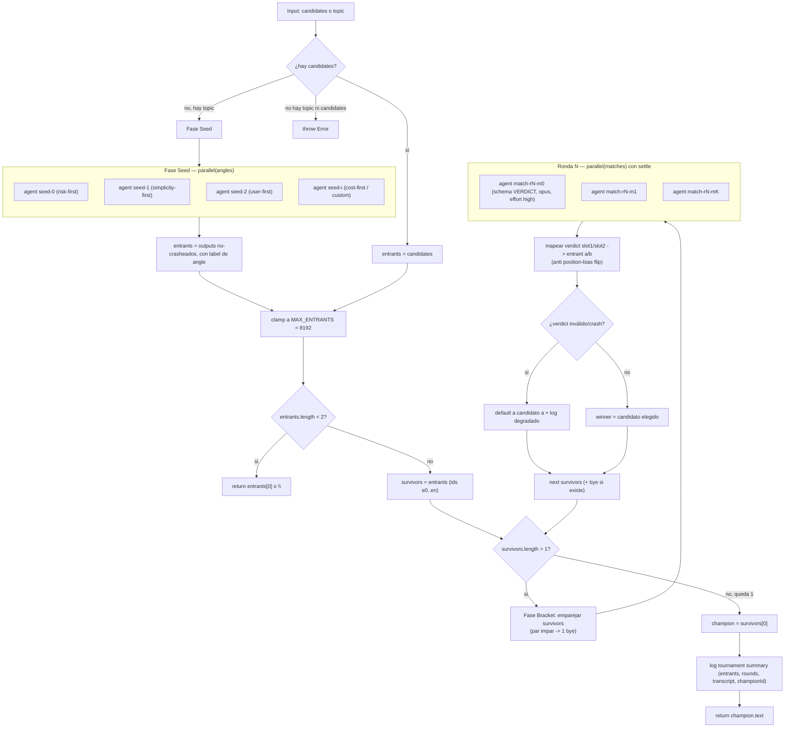

# tournament

> Bracket de eliminación simple: rondas de juicio por pares hasta que sobrevive un solo candidato.

## En 30 segundos

`tournament` enfrenta candidatos de a pares y un juez elige el mejor de cada partido; los ganadores avanzan a la siguiente ronda hasta que queda un solo campeón — como un cuadro de eliminación deportivo. Elegilo cuando necesitás rankear o elegir entre varios borradores/diseños y **no confiás en que un juez le ponga un puntaje absoluto consistente** (ej. "puntuá de 1 a 10"), pero sí confiás en que compare bien dos opciones a la vez ("¿cuál de estas dos es mejor?"). Los candidatos pueden venir explícitos (`candidates`) o generarse solos a partir de un `topic` y varios ángulos de análisis.

## Cómo lanzarlo

```text
/workflow new mi-run --pattern=tournament
```

Input típico (JSON pasado como `args` al workflow) con candidatos explícitos:

```json
{
  "candidates": [
    "Propuesta A: cache en memoria con TTL de 5 minutos",
    "Propuesta B: invalidación por evento vía pub/sub",
    "Propuesta C: sin cache, leer siempre de la fuente"
  ]
}
```

Si no tenés candidatos armados, alcanza con un `topic` y el scaffold genera entrantes desde 4 ángulos por defecto (`risk-first`, `simplicity-first`, `user-first`, `cost-first`):

```json
{
  "topic": "Cómo cachear resultados de una API externa lenta",
  "angles": ["risk-first", "simplicity-first", "user-first"]
}
```

## Diagrama



## Qué hace

`tournament` implementa un bracket de eliminación simple estilo torneo deportivo: en lugar de pedirle a un juez que puntúe cada candidato en una escala absoluta (lo cual es notoriamente poco confiable), lo obliga a resolver comparaciones binarias — "¿cuál de estos dos es mejor?" — que son mucho más fáciles de juzgar con consistencia. Cada ronda empareja a los sobrevivientes, un agente-juez con salida estructurada (`{winner: 1|2, why}`) decide cada partido, los ganadores avanzan y el proceso se repite hasta que queda un solo campeón.

El número de rondas no está fijado de antemano: emerge de los datos como `ceil(log2(n))`, y el bracket se reduce a la mitad en cada iteración hasta colapsar a un sobreviviente. Si el campo tiene un número impar de participantes en una ronda, el último entrante recibe un "bye" (pasa gratis a la siguiente ronda) en vez de fabricarle un rival artificial.

Los candidatos pueden venir explícitos en `input.candidates`, o generarse automáticamente a partir de "ángulos" de análisis distintos (`risk-first`, `simplicity-first`, `user-first`, `cost-first` por defecto) cuando solo se provee un `topic`. Cada partido usa `parallel()` con semántica de "settle" (vía el helper interno, ver más abajo), de modo que un juez que crashea en un partido no hunde toda la ronda: ese partido simplemente se resuelve por default (documentado en el log, nunca en silencio).

Todo el prompt de datos no confiables (`topic`, textos de candidatos) se envuelve con un fence delimitado por un hash derivado del contenido, para blindar contra inyección de instrucciones dentro de los datos que se están juzgando o generando.

## Cuándo usarlo

- Elegir el mejor de varios borradores/diseños (draft de PR, propuestas de arquitectura, textos).
- Ranking comparativo cuando no hay una escala absoluta confiable.
- Selección cabeza a cabeza (head-to-head) entre alternativas.
- El caso general: **la puntuación absoluta es poco confiable pero la comparación por pares es fácil** (ej. "¿cuál código es más legible?" es más fiable que "puntuá este código de 1 a 10").

**No usarlo cuando:**

- Hace falta una puntuación absoluta o un umbral (ej. "aprobar si score > 7") — usar un scaffold de scoring, no un bracket.
- Se necesita explorar pasos intermedios de una solución (no solo candidatos finales) — ver `tree-of-thoughts`.
- Se busca consenso por votación mayoritaria entre razonamientos independientes — ver `self-consistency`.
- Solo hay 0 o 1 candidato: el scaffold corta temprano y devuelve ese único candidato (o `""`) sin gastar rondas de juicio.

## Cómo funciona

1. **Parseo de input y helpers.** `args` se parsea como JSON (con fallback a `{}` si falla). Se define `compact()` para truncar logs largos, y `fence()` para envolver datos no confiables en un delimitador cuyo tag es un hash FNV-like del contenido — no se puede falsear porque el propio contenido determina el tag de cierre, y no usa `Math.random()`/`Date.now()` (prohibidos en el runtime).

2. **Resolución de overrides por rol.** El helper `node(role, extra)` aplica precedencia: `input.models[role]` / `input.efforts[role]` / `input.toolsByRole[role]` / etc. sobre `input.model` / `input.effort` / `input.tools` globales, sobre el default del call-site. Los roles estables usados en este scaffold son `"seed"` (fase Seed) y `"match"` (fase Bracket).

3. **Fase Seed (solo si no hay `input.candidates`).** Requiere `input.topic` (o `question`/`q`/`text`); si no hay ni candidates ni topic, lanza `Error`. Toma `input.angles` (default: 4 ángulos fijos) y por cada ángulo dispara un `agent()` en paralelo (`parallel()`) con el prompt "Propone UN approach concreto" + fence del topic. Modelo fijo `"sonnet"`, effort `"medium"` (ambos sobre-escribibles vía `models.seed`/`efforts.seed`). Los `angles` se clampean a 4096 (límite de `parallel()`). Los resultados se mapean a texto **antes** de filtrar nulls, para que un seed crasheado no corra las etiquetas de ángulo de los siguientes entrantes.

4. **Clamp de campo.** Los entrantes (explícitos o generados) se recortan a `MAX_ENTRANTS = 8192`, para que ninguna ronda del bracket exceda el cap de 4096 thunks por llamada a `parallel()` (una ronda genera como máximo `entrants/2` partidos).

5. **Caso trivial.** Si `entrants.length < 2`, se loguea y se retorna directamente ese único candidato (o `""` si no hay ninguno) — no se corre ningún torneo.

6. **Fase Bracket (loop `while survivors.length > 1`).** En cada ronda:
   - Se emparejan sobrevivientes consecutivos; si el conteo es impar, el último recibe un bye.
   - Se ejecutan los partidos con `parallel()`; cada partido llama a `agent()` con `schema: VERDICT` (`{winner: 1|2, why}`), modelo `"opus"`, effort `"high"` (rol `"match"`, overrideable). Para evitar bias posicional, se alterna qué candidato ocupa el "slot 1" según `(round + i) % 2`.
   - El label de cada match es `match-r{round}-m{i}` — un id estable por ronda+partido para que el cache de prompts no colisione entre rondas.
   - El resultado de `parallel()` viene con settle implícito: si un elemento del array de resultados es falsy/`undefined` (partido crasheado) o el veredicto no trae `winner` válido (1 o 2), se hace default explícito a "candidato 1" (`a`) y se cuenta/loguea como `defaulted` — nunca en silencio.
   - Se registra cada partido en `transcript` (round, match, ids de a/b, winner, why).
   - Los ganadores + el eventual bye forman los `survivors` de la siguiente ronda.

7. **Salida.** Cuando queda un solo sobreviviente, se loguea el campeón y un resumen JSON completo (`entrants`, `rounds`, `transcript`, `championId`) vía `log()` (truncado con `compact()` a 60000 caracteres) — no hay `writeArtifact` en este scaffold, todo el detalle vive en el log del run. La función retorna el texto del campeón (`champion.text`), o `""` si no hay ninguno.

## Input y output

| Campo | Tipo | Default | Notas |
|---|---|---|---|
| `candidates` | `string[]` | — | Si se provee (no vacío tras filtrar falsy), se usa directo como entrantes; tiene prioridad sobre `topic`. |
| `topic` / `question` / `q` / `text` | `string` | — | Usado solo si no hay `candidates`; requerido en ese caso (si falta, `throw`). |
| `angles` | `string[]` | `["risk-first","simplicity-first","user-first","cost-first"]` | Ángulos para generar entrantes cuando no hay `candidates`. Clampeado a 4096 (límite de `parallel()`). |
| `model` / `effort` | `string` | — | Defaults globales para todo nodo (sonnet/opus por rol si no se especifica). |
| `models[role]` / `efforts[role]` | `object` | — | Overrides por rol (`seed`, `match`), tienen prioridad sobre el default global. |
| `tools` / `toolsByRole[role]` | `string[]` | — | Herramientas por defecto / por rol. |
| `skills` / `skillsByRole[role]` | `string[]` | — | Skills por defecto / por rol. |
| `excludeTools` / `excludeByRole[role]` | `string[]` | — | Exclusiones por defecto / por rol. |

Clamps internos (no configurables al alza):

- Ángulos de seed: máx. **4096**.
- Entrantes totales: máx. **8192** (`MAX_ENTRANTS`), para no exceder el cap de 4096 thunks/llamada de `parallel()` en ninguna ronda.

**Output:** el texto del candidato campeón (`string`), o `""` si no hubo ningún entrante válido. No se escriben artifacts con `writeArtifact`; el detalle del torneo (entrantes, rondas, transcript completo por partido, id del campeón) se emite exclusivamente vía `log()` como un bloque JSON compactado a 60000 caracteres.

## Fases

1. **Seed** — genera entrantes desde ángulos distintos cuando no se proveen `candidates` explícitos (fan-out en paralelo, un `agent()` por ángulo).
2. **Bracket** — rondas de juicio por pares en paralelo (`agent({schema})` por partido) que reducen el campo a la mitad hasta quedar un único campeón.
