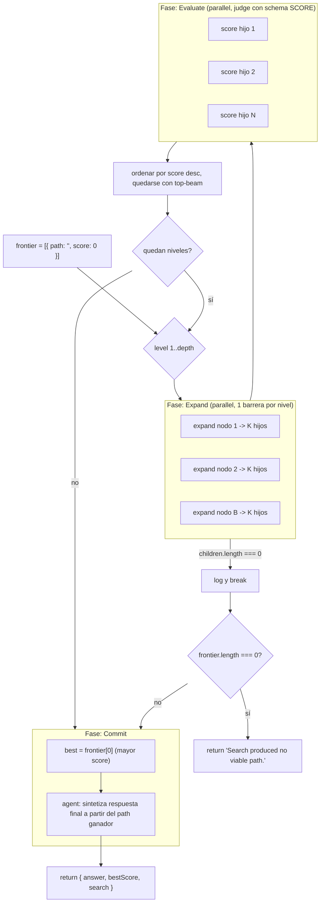

# tree-of-thoughts

> Beam search sobre soluciones parciales: expandí K pensamientos, el juez los puntúa, podá al top-B, recursá hasta la profundidad, y comprometé la respuesta final.

## En 30 segundos

En vez de generar una única cadena de razonamiento, explorá un ÁRBOL de
soluciones parciales: en cada nivel, cada nodo vivo se expande en K
"pensamientos" candidatos, un juez los puntúa a todos, y solo sobreviven los
mejores B (beam width) para el siguiente nivel. Elegilo cuando el problema
tiene pasos intermedios que vale la pena explorar y comparar — no solo
candidatos finales completos.

## Cómo lanzarlo

```
/workflow new mi-tot --pattern=tree-of-thoughts
```

Input típico:

```json
{
  "problem": "Design the gate rollout in 4 staged steps.",
  "branching": 3,
  "beam": 2,
  "depth": 3
}
```

## Diagrama



## Qué hace

`tree-of-thoughts` implementa búsqueda en haz (beam search) sobre soluciones
parciales, siguiendo el paper "Tree of Thoughts: Deliberate Problem Solving
with LLMs" (arXiv:2305.10601). En lugar de comprometerse a una sola cadena de
razonamiento, mantiene una frontera de nodos vivos y, en cada nivel, expande
cada nodo en K pensamientos candidatos distintos entre sí, los hace juzgar
por un modelo evaluador con salida tipada (`score` 0-10 + `why`), y poda todo
menos el top-B por score. El backtracking es implícito: una rama que
puntuaba bien temprano pero deja de mejorar simplemente no sobrevive a la
poda cuando una hermana la supera.

El proceso se repite hasta `depth` niveles (o hasta que un nivel no produce
hijos), y al final el nodo con mayor score de la frontera final se usa como
base para sintetizar la respuesta definitiva.

Es la versión general de `judge-escalate` (que es esto mismo con
`depth=1, beam=1`, es decir best-of-N con a lo sumo una ronda extra). Cuando
la poda por score absoluto no es confiable pero sí la comparación relativa
entre pares, el scaffold hermano `tournament` reemplaza el juez-de-scoring
por rondas de brackets pairwise.

## Cuándo usarlo

- Planificación o diseño multi-paso donde cada paso condiciona al siguiente.
- Explorar un espacio de soluciones donde varias líneas de razonamiento
  parcial compiten y conviene descartar temprano las menos prometedoras.
- Flujo expandir → puntuar → podar → comprometer, con backtracking
  automático vía el juez.
- NO usarlo si el problema no tiene pasos intermedios evaluables por
  separado (para eso alcanza `judge-escalate` o un simple best-of-N), o si
  el costo de `beam × branching × depth` llamadas a `agent` por corrida no
  se justifica frente a un enfoque más barato.

## Cómo funciona

El input se parsea y valida un único campo requerido: `problem` (alias
`question`/`text`/`task`); sin él, el workflow lanza error. Tres parámetros
de búsqueda controlan el árbol: `branching` (K hijos por nodo), `beam` (B
sobrevivientes por nivel) y `depth` (niveles). Cada uno tiene mínimo, default
y tope duro (ver tabla de Input) para mantener `beam × branching` bien por
debajo del límite de 4096 thunks de `parallel()`.

**Fase Expand** (`phase("Expand")`): por cada nodo de la frontera actual y
cada una de las `branching` ramas, se lanza un `agent()` en paralelo (una
sola barrera por nivel vía `parallel()`) que propone UN próximo pensamiento
concreto y distinto de sus hermanos, dado el problema y el camino parcial
acumulado. Corre con modelo `sonnet` / effort `medium` por defecto (rol
`expand`, overrideable). Los datos no confiables (problema, plan parcial) se
envuelven con `fence()`, un delimitador derivado de un hash del contenido
(no de tiempo/random) que impide que el contenido inyecte instrucciones o
falsifique su propio cierre. Si ningún hijo se produce en un nivel, se loguea
y se corta la búsqueda ahí (`break`).

**Fase Evaluate** (`phase("Evaluate")`): cada hijo generado se puntúa en
paralelo con un `agent()` juez que devuelve JSON tipado (`schema: SCORE`,
`score` 0-10 + `why`), modelo `opus` / effort `high` por defecto (rol
`score`). El score se clampea a `[0, 10]` y se loguea si el valor crudo del
modelo estaba fuera de rango. Los hijos se ordenan por score descendente y se
recorta la frontera al top-`beam` (`ranked.slice(0, beam)`) — esa es la poda;
el resto simplemente se descarta, sin retry ni fallback especial para fallos
parciales (un hijo `null` se filtra con `.filter(Boolean)` antes de puntuar).

Este ciclo Expand → Evaluate se repite hasta `depth` niveles. Si la frontera
queda vacía al terminar, el workflow retorna el string
`"Search produced no viable path."` sin llegar a Commit.

**Fase Commit** (`phase("Commit")`): se toma `frontier[0]` (mayor score tras
la última poda) y se pide a un `agent()` (modelo `opus`, effort `high`, rol
`commit`) que escriba la respuesta final autocontenida, construida sobre el
camino de razonamiento ganador (`best.path`), señalando incertidumbre
residual si la hay.

No hay caching explícito ni reintentos automáticos por nodo; la resiliencia
viene de que cada nivel es un batch paralelo con barrera, y un hijo fallido
(`null`) simplemente no compite por la poda.

Los overrides por rol (`expand`, `score`, `commit`) de modelo, effort, tools,
skills y exclusión de tools se resuelven vía `input.models[role]` /
`input.efforts[role]` / etc., con fallback a los defaults globales
(`input.model`, `input.effort`, ...) y finalmente al default hardcodeado de
cada llamada.

## Input y output

| Campo | Tipo | Default | Clamp/tope |
|---|---|---|---|
| `problem` (o `question`/`text`/`task`) | string | — (requerido) | — |
| `branching` | number | 3 | mínimo 2, tope 8 |
| `beam` | number | 2 | mínimo 1, tope 16 |
| `depth` | number | 3 | mínimo 1, tope 8 |
| `model` / `effort` | string | — | aplican a todos los roles salvo override |
| `models.<role>` / `efforts.<role>` | string | — | roles: `expand`, `score`, `commit` |
| `tools`/`skills`/`excludeTools` (+ `...ByRole`) | array | — | por rol o global |

**Output:** objeto `{ answer, bestScore, search }`, donde `answer` es el
texto final sintetizado en Commit, `bestScore` el score (0-10) del camino
ganador, y `search` un eco de `{ branching, beam, depth }` efectivamente
usados (ya clampeados). Si la búsqueda no produce ningún camino viable,
retorna el string `"Search produced no viable path."` en su lugar. El
scaffold no llama a `writeArtifact`; toda la salida viaja en el valor de
retorno.

## Fases

1. **Expand** — expandir cada nodo de la frontera en K pensamientos
   candidatos (paralelo, una barrera por nivel).
2. **Evaluate** — puntuar cada hijo con un juez y podar al top-B
   sobrevivientes.
3. **Commit** — sintetizar la respuesta final a partir del mejor camino de
   la frontera resultante.
