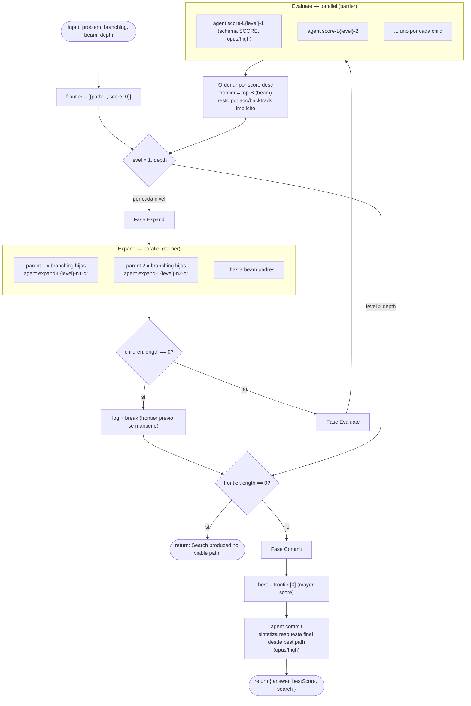

# tree-of-thoughts

> Beam search sobre soluciones parciales: expandir K "pensamientos", puntuarlos con un juez, podar al top-B, recursar en profundidad, y comprometerse con el mejor.

## En 30 segundos

`tree-of-thoughts` explora un problema paso a paso en vez de generar una sola cadena de razonamiento de punta a punta: en cada nivel expande el mejor conjunto de caminos parciales en varias alternativas, un juez las puntúa, y solo las mejores sobreviven al siguiente nivel. Elegilo cuando el problema tiene **pasos intermedios que vale la pena comparar** antes de llegar a una solución completa — por ejemplo, diseñar un rollout en varias etapas donde conviene descartar ramas poco prometedoras temprano.

## Cómo lanzarlo

```bash
/workflow new mi-run --pattern=tree-of-thoughts
```

Esto crea `.pi/workflows/mi-run.js` a partir del scaffold. Para correrlo con un input concreto:

```bash
/workflow run mi-run '{
  "problem": "Diseñar el rollout de un feature flag riesgoso en 4 pasos escalonados",
  "branching": 3,
  "beam": 2,
  "depth": 3
}'
```

`problem` es obligatorio (podés usar `question`/`text`/`task` como alias); `branching`, `beam` y `depth` son opcionales — ver la tabla de Input más abajo para sus defaults y topes.

## Diagrama



## Qué hace

El scaffold implementa una búsqueda tipo *beam search* sobre soluciones parciales, siguiendo el paper Tree of Thoughts (arXiv:2305.10601). Mantiene un *frontier* de caminos parciales y en cada nivel: (1) expande cada nodo en `branching` (K) hijos candidatos generados por un agente, (2) los evalúa con un agente-juez que devuelve un score 0-10 vía schema tipado, y (3) poda quedándose sólo con los `beam` (B) mejores. Esto se repite hasta `depth` niveles.

El "backtracking" es implícito: no hay marcha atrás explícita, sino que una rama que puntuó bien temprano pero deja de mejorar simplemente queda fuera del top-B en el siguiente corte. La búsqueda se auto-poda: el presupuesto de expansión se gasta sólo en los caminos que el juez considera prometedores, no en explorar todo el árbol.

Al terminar (o si se agota antes por falta de hijos), se toma el mejor nodo del frontier final y un agente de síntesis escribe la respuesta completa a partir del camino de razonamiento ganador. El costo total del fan-out está acotado: `branching` se cachea en 8 y `beam` en 16, para que `beam * branching` (thunks por nivel) se mantenga muy por debajo del límite de 4096 thunks de `parallel()`.

## Cuándo usarlo

| Situación | Scaffold recomendado |
|---|---|
| El problema tiene pasos intermedios que vale explorar y comparar antes de comprometerse (no sólo candidatos finales completos) | **tree-of-thoughts** |
| Problema de un solo paso, sin noción clara de "solución parcial evaluable" | `judge-escalate` (equivale a este scaffold con `depth=1, beam=1`: más simple y barato) |
| Conviene comparación relativa/pareada en vez de puntaje absoluto | `tournament` (brackets pairwise en lugar de juez con rúbrica) |

Ejemplo típico: "diseñar el rollout de un gate en 4 pasos escalonados", donde cada paso se puede juzgar antes de seguir.

## Cómo funciona

**Setup.** Parsea `input` (JSON string u objeto), resuelve `problem`/`question`/`text`/`task` como el enunciado (obligatorio, lanza error si falta). Construye overrides por-rol de modelo/effort/tools/skills/excludeTools vía el helper `node(role, extra)`, con precedencia: override por-rol > default global (`input.model`/`input.effort`) > default del call-site. Clampa `branching` (mínimo 2, default 3, tope 8), `beam` (mínimo 1, default 2, tope 16) y `depth` (mínimo 1, default 3, tope 8), logueando si algún valor se reduce por el cap.

Usa dos utilidades de seguridad: `compact(d, n)` trunca datos largos a 60000 chars (8000/40000 en usos puntuales), y `fence(kind, d)` envuelve datos no confiables en un delimitador `<untrusted-HASH kind="...">` cuyo tag se deriva de un hash FNV-like del contenido — así un payload malicioso no puede forgear el marcador de cierre porque cambiaría el hash. Todo el texto del problema/inputs de usuario se pasa a los agentes envuelto en este fence, con instrucciones explícitas de tratarlo como DATA, nunca como instrucciones.

**Fase Expand** (una por nivel): por cada nodo del frontier actual, dispara `branching` llamadas `agent()` en paralelo (`parallel()`, que actúa como barrera) pidiendo "un próximo paso" que extienda ese camino parcial. Modelo `sonnet`, effort `medium`, label `expand-L{level}-n{ni}-c{ci}`. Si el resultado es `null` se descarta; si no queda ningún hijo, se loguea y se rompe el loop (se conserva el frontier del nivel anterior).

**Fase Evaluate** (misma iteración): cada hijo se pasa a un agente-juez (`model: opus`, `effort: high`, `schema: SCORE`) que devuelve `{ score: number 0-10, why: string }`. El score se clampa a [0,10] (logueando si el valor crudo estaba fuera de rango) y se ordena todo el conjunto de mayor a menor score. El nuevo `frontier` es el slice top-`beam`; el resto se descarta (poda/backtrack implícito).

**Fase Commit** (una sola vez al final): si el frontier quedó vacío se retorna `"Search produced no viable path."` sin llamar a ningún agente. Si no, se toma `best = frontier[0]` y se llama a un agente de síntesis (`model: opus`, `effort: high`) que escribe la respuesta final a partir del `best.path` completo (truncado a 40000 chars vía `compact`), pidiéndole que sea autocontenida y señale incertidumbre residual.

**Manejo de fallos parciales**: los hijos `null` se filtran silenciosamente con `.filter(Boolean)`; si TODOS fallan en un nivel, se corta la búsqueda ahí en vez de propagar el error. No hay reintento explícito ni caching entre corridas — cada invocación es una búsqueda desde cero.

## Input y output

**Input** (objeto o JSON string vía `args`):

| Campo | Tipo | Default | Notas |
|---|---|---|---|
| `problem` / `question` / `text` / `task` | string | — | **Obligatorio**; primero que exista en ese orden. Si ninguno está presente, lanza error. |
| `branching` | number | `3` | Mínimo 2, cap **8** (log si se reduce). K hijos por nodo. |
| `beam` | number | `2` | Mínimo 1, cap **16** (log si se reduce). B supervivientes por nivel. |
| `depth` | number | `3` | Mínimo 1, cap **8** (log si se reduce). Niveles de búsqueda. |
| `model` / `effort` | string | — | Defaults globales aplicados a todos los nodos (roles: `expand`, `score`, `commit`). |
| `models[role]` / `efforts[role]` | object | — | Override por rol, tiene prioridad sobre el default global. |
| `tools` / `toolsByRole[role]` | array | — | Igual patrón de precedencia para tools por rol. |
| `skills` / `skillsByRole[role]` | array | — | Igual patrón para skills por rol. |
| `excludeTools` / `excludeByRole[role]` | array | — | Igual patrón para excludeTools por rol. |

**Output** (valor de retorno del `main()`):

- Camino feliz: `{ answer: string, bestScore: number (0-10), search: { branching, beam, depth } }`.
- Caso degenerado (frontier vacío tras podar todo o tras cortar por falta de hijos en el primer nivel): retorna el string `"Search produced no viable path."`.
- **No se observan llamadas a `writeArtifact`** en el código — el scaffold no persiste artifacts en disco; toda la salida viaja en el valor de retorno.

## Fases

1. **Expand** — expandir cada nodo del frontier en `branching` hijos candidatos vía agentes en paralelo (una ejecución por nivel de profundidad).
2. **Evaluate** — puntuar cada hijo con un agente-juez (schema tipado 0-10) y podar al top-`beam` (también una ejecución por nivel).
3. **Commit** — sintetizar la respuesta final a partir del mejor camino del frontier resultante (una sola vez, al cierre de la búsqueda).
</content>
</invoke>
