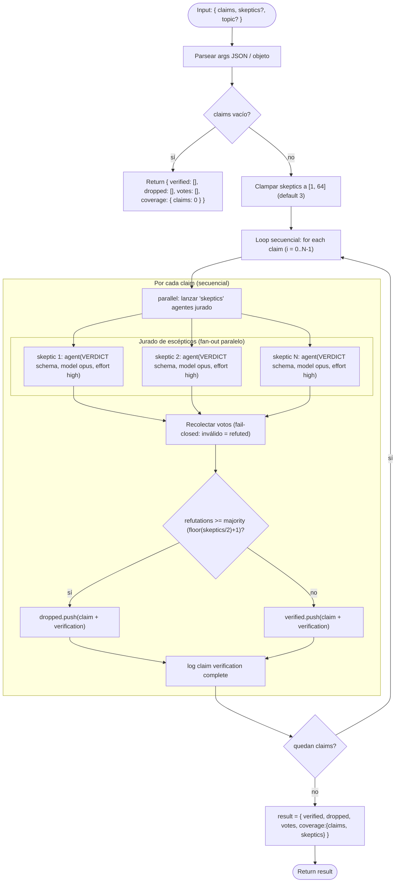

# verify-claims-lib

> Sub-workflow reutilizable: verifica `{ claims, skeptics? }` con jurados de escépticos y devuelve verified/dropped/votes/coverage.

## En 30 segundos

Es el paso de "verificación" extraído a librería: dado un array de `claims` ya descubiertas, convoca por cada una un jurado paralelo de agentes escépticos que intentan refutarla con evidencia concreta, y solo sobreviven (`verified`) las que resisten una mayoría estricta de refutaciones. No descubre ni sintetiza nada — elegilo cuando un workflow padre (típicamente `composition-driver`) ya separó "descubrir afirmaciones" de "verificarlas" y necesita ese segundo paso como pieza reutilizable, no como entrypoint final por sí solo.

## Cómo lanzarlo

```text
/workflow new mi-run --pattern=verify-claims-lib
/workflow run mi-run {"claims": [{"id": "c1", "claim": "El endpoint /login soporta rate limiting", "evidence": "src/auth.ts:42"}], "skeptics": 3, "topic": "auditoría de auth"}
```

`claims` es el único campo obligatorio (cada elemento necesita al menos `claim`); `skeptics` y `topic` son opcionales y ya traen los defaults de arriba (`3` y `"n/a"`). En la práctica casi siempre se invoca desde otro workflow vía `workflow("verify-claims-lib", args)`, no como entrypoint final — ver [Cuándo usarlo](#cuándo-usarlo). Para overrides por rol (`model`, `models`, `tools`, etc.) ver [Input y output](#input-y-output).

## Diagrama



## Qué hace

El criterio de supervivencia es una mayoría estricta del tamaño **fijo** del jurado: si el número de refutaciones es `>= floor(skeptics/2) + 1`, la afirmación cae en `dropped`; si no, sobrevive en `verified`. Los empates sobreviven (se requiere mayoría estricta para matar). El código deja explícito (comentario "F1") que está armonizado con `adversarial-verify`: un veredicto ausente o inválido de un escéptico no ayuda a sobrevivir, sino que cuenta como refutación (fail-closed), evitando que un fallo parcial infle artificialmente la supervivencia de una claim.

Es, en esencia, la extracción a librería de la fase de "jurado escéptico" de `adversarial-verify`, pensada para ser compuesta dentro de workflows más grandes en lugar de ejecutarse de forma standalone.

## Cuándo usarlo

| Situación | ¿Usarlo? |
|---|---|
| Un workflow padre necesita verificación como building block reutilizable (caso canónico: `composition-driver`) | Sí |
| El workflow ya **descubrió** afirmaciones y ahora necesita **verificarlas** como paso separado | Sí |
| Se quiere un verificador compartido dentro de un pipeline de composición más grande | Sí |
| No hay un paso previo de discovery que produzca `{id, claim, evidence?}` | No — este scaffold no genera claims, solo las verifica |
| Se necesita el flujo end-to-end (discover → verify → synthesize) en un solo paso | No — usar `composition-driver` u otro orquestador, no este como entrypoint final |
| `claims` llega vacío | No hace falta invocarlo — el propio scaffold retorna de inmediato `{ verified: [], dropped: [], votes: [], coverage: { claims: 0 } }` sin gastar agentes |

## Cómo funciona

**Fase única: "Verify Claims".** Todo el trabajo ocurre en una sola fase declarada en `meta.phases`; no hay fases de discovery ni de síntesis (eso vive en el workflow que lo compone).

1. **Parseo de input.** `args` puede llegar como string JSON o como objeto; se parsea de forma defensiva (try/catch → `{}` si falla).
2. **Normalización de claims.** Se filtran los elementos de `input.claims` que tengan un campo `claim` truthy. Si el resultado es vacío, retorna inmediatamente el shape vacío sin invocar ningún agente.
3. **Clamp de `skeptics`.** `input.skeptics` se coerciona a entero y se clampa a `[1, 64]`, con default `3` si no es un número finito. Si el valor pedido excede el máximo, se loggea el clamp (`skeptics clamped down`).
4. **Overrides por rol.** Soporta `input.model`/`input.effort` como defaults globales y `input.models[role]`/`input.efforts[role]` (rol = `"skeptic"`) como overrides específicos, igual que `input.tools`/`input.skills`/`input.excludeTools` vía `toolsByRole`/`skillsByRole`/`excludeByRole`. La precedencia es: override por rol > default global > default del call-site (que en este caso hardcodea `model: "opus"`, `effort: "high"` para el nodo skeptic, sobreescribible).
5. **Loop secuencial sobre claims.** Para cada claim (en orden, uno a la vez — no en paralelo entre claims):
   - Se lanza `parallel(...)` con `skeptics` agentes concurrentes, cada uno un "skeptic j/N" con instrucciones explícitas de intentar refutar la claim con evidencia concreta, y con protección de prompt-injection: los datos de `topic`/`claim`/`evidence` se envuelven con `fence(...)`, un delimitador derivado de un hash FNV-like del contenido (no de aleatoriedad, ya que el runtime prohíbe `Math.random`/`Date.now`), para que texto malicioso embebido no pueda forjar un marcador de cierre falso.
   - Cada agente devuelve un JSON validado contra el schema `VERDICT` (`refuted: boolean`, `confidence: string`, `evidence: string`, `why: string`), con `model: "opus"` y `effort: "high"` por defecto.
   - Los votos se normalizan: cualquier resultado sin `refuted` boolean válido (agente caído o output inválido) se reemplaza por un voto default `{ refuted: true, confidence: "low", evidence: "", why: "skeptic failed/invalid -> default refuted" }` — es decir, **fail-closed**.
   - Se cuenta `refutations` y se compara contra `majority = floor(skeptics/2) + 1`; `survived = refutations < majority`.
   - Se construye un `record` con la claim, los votos parseados, el número de branches fallidos, el conteo de refutaciones y el veredicto de supervivencia; se acumula en `votes`, y la claim (enriquecida con `verification: record`) se empuja a `verified` o `dropped`.
   - Se loggea el progreso por claim (`claim verification complete`, con índice/total/survived/refutations/votos/fallos).
6. **Resultado final.** Se retorna `{ verified, dropped, votes, coverage: { claims: claims.length, skeptics } }`. No hay `writeArtifact` en este scaffold — es puramente funcional/retorno de valor, delegando la persistencia (si la hay) al workflow padre.

No hay caching explícito (`cache: true/false` no aparece) ni pipeline/gate adicionales; el único mecanismo de manejo de fallos parciales es el fail-closed en el conteo de votos.

## Input y output

**Input** (`{ claims:[{id, claim, evidence?}], skeptics?, topic? }`):

| Campo | Tipo | Default / Clamp | Notas |
|---|---|---|---|
| `claims` | `Array<{id?, claim, evidence?}>` | filtra por `claim` truthy; si queda vacío, corta temprano | obligatorio para hacer trabajo real |
| `skeptics` | number | default `3`; clamp `[1, 64]` | se loggea si el pedido excede 64 |
| `topic` | string | `"n/a"` si ausente | se trunca a 4000 chars vía `compact` |
| `model` / `effort` | string | aplican a todos los nodos (rol `skeptic`) | override global |
| `models[role]` / `efforts[role]` | object | rol = `"skeptic"` | override por rol, precedencia sobre global |
| `tools` / `skills` / `excludeTools` (+ `*ByRole`) | array | igual patrón global/por-rol | pasan al agente skeptic |

**Output**:

```json
{
  "verified": [ /* claims con verification.survived = true */ ],
  "dropped": [ /* claims con verification.survived = false */ ],
  "votes": [ /* un record por claim: {claim, parsedVotes, failedBranches, refutations, survived} */ ],
  "coverage": { "claims": "<n>", "skeptics": "<n>" }
}
```

No escribe artifacts en disco (`writeArtifact` no se usa en este scaffold); todo el output se retorna al caller (típicamente `composition-driver`).

## Fases

1. **Verify Claims** — única fase declarada en `meta.phases`; ejecuta el loop secuencial de claims, cada una resuelta mediante un fan-out paralelo de agentes escépticos con schema `VERDICT`, y produce `verified`/`dropped`/`votes`/`coverage` como resultado final.
