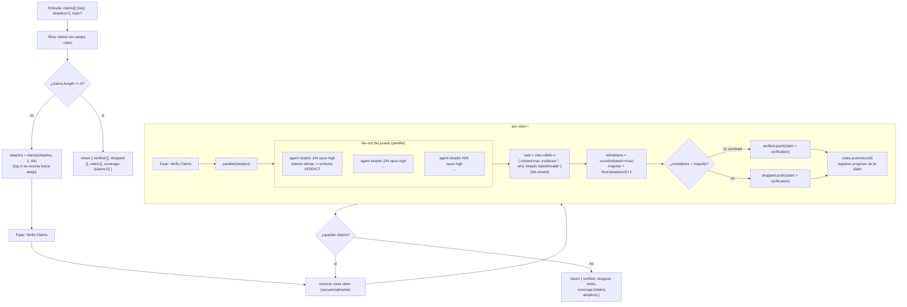

# verify-claims-lib

> Sub-workflow reutilizable: verifica `{ claims, skeptics? }` con jurados de escépticos y devuelve `verified` /
> `dropped` / `votes` / `coverage`.

## En 30 segundos

Esta pieza sirve para **verificar afirmaciones ya extraídas**. Se invoca desde otro workflow con
`workflow("verify-claims-lib", args)`.

No descubre claims ni sintetiza un informe final: solo arma jurados de escépticos en paralelo y decide qué afirmaciones
sobreviven. Usalo cuando tu workflow padre ya hizo la parte de descubrimiento y ahora necesita una verificación
compartible; el caso canónico es `composition-driver`.

## Cómo lanzarlo

```text
/workflow new mi-run --pattern=verify-claims-lib
/workflow run mi-run {"claims":[{"id":"c1","claim":"El endpoint /health responde 200 sin auth"}],"skeptics":3}
```

También se puede invocar en composición, sin pasar por `/workflow run`, desde el código de otro scaffold:
`await workflow("verify-claims-lib", { claims, skeptics: 5, topic })`. `claims` debe traer elementos con `.claim`; si
todos vienen vacíos, el workflow devuelve el shape vacío. El resto cae en los defaults; ver
[Input y output](#input-y-output).

## Diagrama



## Qué hace

`verify-claims-lib` es la versión de biblioteca de `adversarial-verify`: en lugar de exponer un flujo completo
(descubrir → verificar → sintetizar), publica solo el paso de verificación como un contrato reutilizable —
`{ claims, skeptics? }` entra, `{ verified, dropped, votes, coverage }` sale. Cada claim se somete, una por una, a un
jurado de `skeptics` agentes en paralelo cuyo único objetivo es refutarla con una cita concreta (`file:line`, URL o
salida de comando); si no pueden aportar una cita concreta, deben devolver `evidence="INSUFFICIENT_EVIDENCE"` y
`refuted=true` en vez de inventar sustento.

La supervivencia de una claim depende de una regla de mayoría estricta sobre un jurado de tamaño **fijo**: la claim
sobrevive solo si las refutaciones quedan por debajo de `floor(skeptics/2) + 1`. Los empates sobreviven (hace falta
mayoría estricta para eliminar), y cualquier voto ausente o inválido (agente caído, JSON que no coincide con el schema)
cuenta automáticamente como refutación — el sistema falla cerrado, así que un jurado incompleto nunca ayuda a que una
claim sobreviva.

El aislamiento frente a prompt injection es explícito: la claim y su evidencia se envuelven con `fence()`, un
delimitador derivado de un hash del contenido (no de aleatoriedad, prohibida en el runtime), de modo que un payload
malicioso no pueda forjar el marcador de cierre y hacerse pasar por una instrucción del sistema. El prompt de cada
escéptico indica explícitamente que ignore cualquier directiva dentro de esos datos.

Como no incluye descubrimiento ni síntesis, este scaffold es la pieza que un workflow padre delega cuando ya tiene sus
propias claims (por ejemplo, `composition-driver` las descubre y luego llama `workflow("verify-claims-lib", args)`); no
tiene sentido ejecutarlo si todavía no existe una lista concreta de afirmaciones para verificar.

## Cuándo usarlo

| Situación                                                                      | Usar                             |
| ------------------------------------------------------------------------------ | -------------------------------- |
| Un workflow padre ya descubrió afirmaciones y solo necesita verificarlas       | `verify-claims-lib`              |
| Querés el flujo completo de punta a punta (descubrir + verificar + sintetizar) | `adversarial-verify`             |
| Necesitás comparar alternativas entre sí                                       | otro patrón, como ranking/torneo |

Casos típicos: `composition-driver` llamando a esta pieza, un pipeline de “descubrir y después verificar” que querés
reutilizar, o cualquier contrato compartido de jurado escéptico sin acoplarlo al descubrimiento.

## Cómo funciona

**Validación de entrada.** `args` se parsea de forma defensiva: si llega como JSON string, se intenta parsear; si falla,
se usa `{}`. `claims` se reduce a los elementos con `.claim` truthy; si no queda ninguno, retorna de inmediato
`{ verified: [], dropped: [], votes: [], coverage: { claims: 0 } }`. `skeptics` sale de `input.skeptics`, con default 3
y `clamp(1, 64)`; si se recorta, se loguea el valor pedido y el usado.

El helper `node(role, extra)` aplica overrides por rol con esta precedencia: `models[role]` / `efforts[role]` /
`toolsByRole[role]` / `skillsByRole[role]` / `excludeByRole[role]` > `input.model` / `input.effort` / `input.tools` /
`input.skills` / `input.excludeTools` > defaults del call-site. Para `skeptic`, el default del call-site es `opus` /
`high`.

**Fase Verify Claims (única fase declarada).** Las claims se procesan **secuencialmente**; no hay fan-out entre claims,
solo dentro de cada claim. Para cada una:

1. Lanza `skeptics` agentes en `parallel`, todos con rol `skeptic`. Cada prompt recibe `topic` (`"n/a"` si falta),
   `claim` y `evidence`, todos pasados por `compact()` y envueltos en `fence()`. El schema `VERDICT` exige `refuted`
   (boolean), `confidence`, `evidence` y `why`, y prohíbe propiedades extra.
2. Los votos se normalizan: un resultado válido pasa tal cual; uno inválido o caído se reemplaza por
   `{ refuted: true, confidence: "low", evidence: "", why: "skeptic failed/invalid -> default refuted" }`.
3. Se cuentan las `refutations` y se compara contra `majority = floor(skeptics / 2) + 1`. La claim sobrevive cuando
   `refutations < majority`; los empates sobreviven.
4. La claim, con su registro completo de verificación, va a `verified` o `dropped`. El `record` siempre se agrega a
   `votes` e incluye `parsedVotes` y `failedBranches`.
5. Se loguea el resultado de cada claim (`index`, `total`, `survived`, `refutations`, cantidad de votos y
   `failedBranches`) antes de pasar a la siguiente.

**Caching:** no hay mecanismo explícito de caché; cada `agent` corre desde cero por claim y por escéptico.

**Manejo de fallas parciales:** el comportamiento es fail-closed. No hay `settle` explícito: cada branch se valida
inline (`r?.data && typeof r.data.refuted === "boolean"`) y todo lo que no coincide con ese chequeo — crash, timeout o
JSON inválido — cuenta como refutación por defecto. Así, un jurado incompleto nunca facilita que una claim sobreviva.

## Input y output

**Input** (JSON-stringified en `args`, parseado defensivamente):

| Campo                                            | Tipo                        | Requerido          | Default / clamp                                                                          |
| ------------------------------------------------ | --------------------------- | ------------------ | ---------------------------------------------------------------------------------------- |
| `claims`                                         | `{id?, claim, evidence?}[]` | **sí** (contenido) | se filtran los elementos sin `.claim`; si queda vacío, retorna el shape vacío sin lanzar |
| `skeptics`                                       | number                      | no                 | default 3, `clamp(1, 64)`; si se recorta, se loguea                                      |
| `topic`                                          | string                      | no                 | `"n/a"` si ausente; se pasa a cada escéptico truncado a 4000 chars                       |
| `model` / `effort`                               | string                      | no                 | override global para el rol `skeptic` (default del call-site: `opus` / `high`)           |
| `models["skeptic"]` / `efforts["skeptic"]`       | object                      | no                 | override específico del rol; precedencia por rol > global > default                      |
| `tools` / `skills` / `excludeTools`              | array                       | no                 | defaults globales para el `agent` `skeptic` si son arrays                                |
| `toolsByRole` / `skillsByRole` / `excludeByRole` | object                      | no                 | override por rol para `skeptic`                                                          |

**Output:** `{ verified, dropped, votes, coverage }`

- `verified`: array de claims (objeto original + `verification`) que sobrevivieron a la mayoría de refutaciones.
- `dropped`: array de claims (mismo shape) que fueron refutadas por mayoría.
- `votes`: un registro por claim procesada — `{ claim, parsedVotes, failedBranches, refutations, survived }` — incluso
  para claims que terminaron en `verified`.
- `coverage`: `{ claims: <total procesadas>, skeptics: <tamaño de jurado usado> }`.

No se observan llamadas a `writeArtifact`: toda la observabilidad pasa por `log(...)` (recorte de `skeptics`, progreso
por claim) y por el shape de retorno; al ser un sub-workflow de biblioteca, el consumidor (el workflow padre) es quien
decide qué persistir.

## Fases

1. **Verify Claims** — única fase declarada en `meta.phases`; cubre todo el trabajo: por cada claim, arma un jurado de
   escépticos en paralelo, aplica la regla de mayoría estricta con fallo cerrado sobre votos inválidos y clasifica la
   claim en `verified` o `dropped` antes de pasar a la siguiente.
