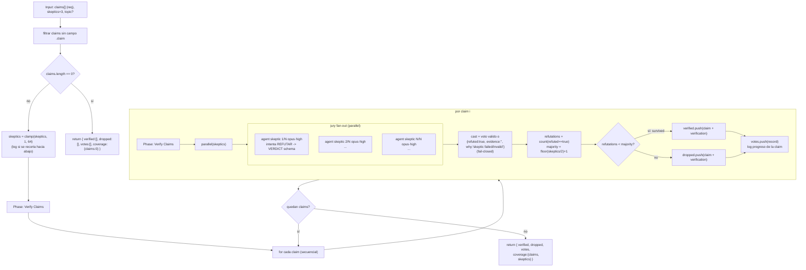

# verify-claims-lib

> Sub-workflow reutilizable: verifica `{ claims, skeptics? }` con jurados de escépticos y devuelve verified/dropped/votes/coverage.

## En 30 segundos

Es un bloque de verificación pensado para ser **llamado desde otro workflow** (vía `workflow("verify-claims-lib", args)`), no para correrse solo como flujo de punta a punta. Recibe una lista de afirmaciones ya extraídas y, para cada una, arma un jurado de escépticos en paralelo que intenta refutarla con evidencia concreta; una afirmación sobrevive solo si no logra reunir mayoría de refutaciones. Elegilo cuando tu propio workflow ya descubrió las claims y solo necesita la verificación como pieza reusable (el ejemplo canónico es `composition-driver`, que descubre y delega esta pieza).

## Cómo lanzarlo

```text
/workflow new mi-run --pattern=verify-claims-lib
/workflow run mi-run {"claims":[{"id":"c1","claim":"El endpoint /health responde 200 sin auth"}],"skeptics":3}
```

También se invoca en composición, sin pasar por `/workflow run`, desde el código de otro scaffold: `await workflow("verify-claims-lib", { claims, skeptics: 5, topic })`. `claims` es el único campo con contenido real requerido (una claim sin `.claim` se descarta); el resto tiene defaults — ver [Input y output](#input-y-output).

## Diagrama



## Qué hace

`verify-claims-lib` es la forma "biblioteca" de `adversarial-verify`: en vez de un flujo completo (descubrir → verificar → sintetizar), expone solo el paso de verificación como un contrato reutilizable — `{ claims, skeptics? }` entra, `{ verified, dropped, votes, coverage }` sale. Cada claim se somete, una por una, a un jurado de `skeptics` agentes en paralelo cuyo único objetivo es intentar refutarla con una cita concreta (file:line, URL, o salida de comando); si no aportan una cita concreta, deben declarar `evidence="INSUFFICIENT_EVIDENCE"` y `refuted=true` en vez de inventar sustento.

La supervivencia de una claim depende de una regla de mayoría estricta sobre el tamaño **fijo** del jurado: sobrevive solo si las refutaciones quedan por debajo de `floor(skeptics/2) + 1`. Los empates sobreviven (hace falta mayoría estricta para matar), y cualquier voto ausente o inválido (agente caído, JSON que no matchea el schema) cuenta automáticamente como refutación — el sistema falla cerrado, así que un jurado incompleto nunca facilita que una claim sobreviva.

El aislamiento de prompt-injection es explícito: la claim y su evidencia se envuelven con `fence()`, un delimitador derivado de un hash del contenido (no de aleatoriedad, prohibida en el runtime), de modo que un payload malicioso no puede forjar el marcador de cierre y hacerse pasar por instrucción del sistema. El prompt de cada escéptico instruye explícitamente ignorar cualquier directiva dentro de esos datos.

Al no incluir descubrimiento ni síntesis, este scaffold es la pieza que un workflow padre delega cuando ya tiene sus propias claims (por ejemplo, `composition-driver` las descubre y llama `workflow("verify-claims-lib", args)`); no tiene sentido correrlo si todavía no existe una lista concreta de afirmaciones a verificar.

## Cuándo usarlo

- Un workflow padre ya descubrió afirmaciones (de un documento, de resultados de otro agente, etc.) y necesita verificación como building block — caso de uso canónico: llamado por `composition-driver`.
- Cualquier flujo de "descubrir, después verificar" donde la etapa de verificación se quiere reusar tal cual en más de un lugar.
- Se busca un verificador compartido con jurado de escépticos, sin acoplarlo al paso de descubrimiento.
- **No usarlo** si necesitás el flujo completo de punta a punta (descubrir + verificar + sintetizar reporte) — para eso está `adversarial-verify`, del cual este scaffold es la forma "librería".
- **No usarlo** para juicios comparativos entre alternativas (eso es un patrón de ranking/torneo, no de verificación de claims individuales).

## Cómo funciona

**Validación de entrada.** El input se parsea defensivamente (JSON o objeto ya parseado; si falla, `{}`). `claims` se filtra a solo los elementos con un campo `.claim` truthy; si el resultado queda vacío, retorna inmediatamente el shape completo con todos los campos en cero/vacío (nunca lanza excepción). `skeptics` se sanea con `clamp(1, 64)`, y si el valor pedido excedía el máximo se loguea el recorte explícitamente.

**Fase Verify Claims (única fase declarada).** Itera las claims **secuencialmente** (no hay fan-out entre claims, solo dentro de cada claim). Para cada una:

1. Lanza un `agent` por cada uno de los `skeptics` jueces, todos en `parallel`, rol `skeptic` (modelo `opus`, effort `high` — se prioriza rigor sobre costo, a diferencia del mapper barato de `map-reduce`). El prompt de cada juez recibe el `topic` opcional, la `claim` y su `evidence` (`"none"` si no se proveyó), todos truncados a un límite de caracteres (`compact()`, 4000/2000) y envueltos en `fence()`. El schema de salida (`VERDICT`) exige `refuted` (boolean), `confidence`, `evidence` y `why`, con `additionalProperties:false`.
2. Los votos se normalizan (`cast`): un voto válido pasa tal cual; uno inválido o de un branch caído se reemplaza por `{refuted:true, confidence:"low", evidence:"", why:"skeptic failed/invalid -> default refuted"}` — el patrón fail-closed mencionado arriba.
3. Se cuentan las `refutations` y se compara contra `majority = floor(skeptics/2)+1`; `survived = refutations < majority`.
4. La claim (con su registro de verificación completo) va a `verified` o `dropped` según corresponda; el registro (`record`) siempre se agrega a `votes`, incluyendo cuántos branches fallaron (`failedBranches`).
5. Se loguea el resultado de cada claim (índice, total, `survived`, `refutations`, cantidad de votos, `failedBranches`) antes de pasar a la siguiente.

**Caching:** no hay mecanismo explícito de caché; cada `agent` corre fresco por claim y por escéptico.

**Manejo de fallos parciales:** no se usa `settle` explícito (no hay filtrado de nulls post-`parallel`); en su lugar, cada resultado de jurado se valida inline (`r?.data && typeof r.data.refuted === "boolean"`) y todo lo que no matchea ese chequeo — crash, timeout, JSON inválido — se convierte en un voto de refutación por defecto, preservando siempre `skeptics` votos contados por claim.

## Input y output

**Input** (JSON-stringified en `args`, parseado defensivamente):

| Campo | Tipo | Requerido | Default / clamp |
|---|---|---|---|
| `claims` | `{id?, claim, evidence?}[]` | **sí** (contenido) | se filtran los elementos sin `.claim`; si queda vacío, retorna shape vacío sin lanzar |
| `skeptics` | number | no | default 3, clamp 1..64 (log si se recorta hacia abajo) |
| `topic` | string | no | `"n/a"` si ausente; se pasa a cada escéptico truncado a 4000 chars |
| `model` / `effort` | string | no | override global para el rol `skeptic` (default: `opus` / `high`) |
| `models["skeptic"]` / `efforts["skeptic"]` | object | no | override específico del rol; precedencia por-rol > global > default del call-site |
| `tools` / `skills` / `excludeTools` (y `*ByRole`) | array | no | pasados al `agent` skeptic si son arrays |

**Output:** `{ verified, dropped, votes, coverage }`

- `verified`: array de claims (objeto original + `verification`) que sobrevivieron la mayoría de refutaciones.
- `dropped`: array de claims (mismo shape) que fueron refutadas por mayoría.
- `votes`: un registro por claim procesada — `{ claim, parsedVotes, failedBranches, refutations, survived }` — incluso para claims que terminaron en `verified`.
- `coverage`: `{ claims: <total procesadas>, skeptics: <tamaño de jurado usado> }`.

No se observan llamadas a `writeArtifact`: toda la observabilidad pasa por `log(...)` (recorte de `skeptics`, progreso por claim) y por el shape de retorno; al ser un sub-workflow de librería, el consumidor (el workflow padre) es quien decide qué persistir.

## Fases

1. **Verify Claims** — única fase declarada en `meta.phases`; cubre todo el trabajo: por cada claim, arma un jurado de escépticos en paralelo, aplica la regla de mayoría estricta con fallo cerrado sobre votos inválidos, y clasifica la claim en `verified` o `dropped` antes de pasar a la siguiente.
