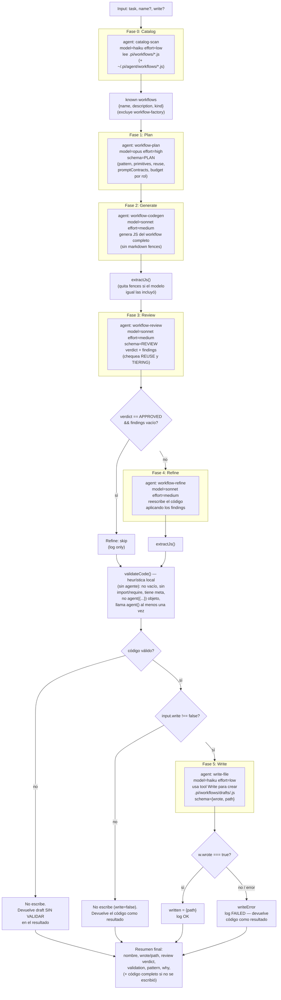

# workflow-factory

> Meta-workflow: catálogo → plan → generar → revisar → refinar, y luego escribe `.pi/workflows/drafts/<slug>.js`.

## En 30 segundos

`workflow-factory` no ejecuta tu tarea: la usa como brief para **diseñar y generar otro workflow** a medida, y lo deja como draft en disco para que lo revises antes de correrlo. Elegilo cuando ningún scaffold existente calza con la tarea y necesitás uno nuevo (o una especialización de uno existente) generado por agentes en vez de escrito a mano — no para tareas chicas o de bajo riesgo, donde el ciclo Plan(opus)→Generate→Review→Refine es más caro que resolver la tarea inline.

## Cómo lanzarlo

```text
/workflow new mi-run --pattern=workflow-factory
```

Con un input típico:

```json
{
  "task": "audit GraphQL resolvers for N+1 queries",
  "write": true
}
```

`task` es el único campo requerido. Si el draft resultante te convence, inspeccionalo en `.pi/workflows/drafts/<slug>.js` y recién ahí corrélo con concurrencia explícita — nunca sin revisión humana.

## Diagrama



## Qué hace

`workflow-factory` es un meta-workflow: en lugar de ejecutar directamente una tarea, gasta una corrida completa en **diseñar y generar** el workflow específico para esa tarea, dejándolo como un archivo draft en `.pi/workflows/drafts/<slug>.js` listo para inspección antes de confiar en él.

El diseño es *catalog-aware*: antes de planificar, una fase de descubrimiento (Fase 0) lee los scaffolds ya existentes (`.pi/workflows/*.js` del proyecto y, si existe, `~/.pi/agent/workflows/*.js` global) y extrae su `meta.name`/`meta.description`, clasificándolos como `lib` (sub-workflow reusable, ej. terminado en `-lib`), `composed` (usa `workflow(...)`) o `base`. Ese catálogo se inyecta en las fases de Plan, Generate y Review para que el modelo **prefiera reusar/especializar** un scaffold existente o **componerlo** vía `workflow(name, args)` en lugar de reinventar lógica, y para que el plan justifique explícitamente construir desde cero cuando nada calza.

El pipeline central es Plan → Generate → Review → Refine (condicional) → Write, con un gate de validación estructural puramente local (sin agente) antes de cualquier escritura a disco. El resultado generado es tratado como no confiable por defecto: se sanitiza el input untrusted con fences derivados de hash de contenido, se valida sintácticamente contra invariantes duras del runtime, y solo se escribe si pasa esa validación; si algo falla, el código se devuelve igual en el resultado para inspección manual, nunca se descarta silenciosamente.

El workflow soporta composición recursiva acotada por profundidad (`workflow(name, args)` dentro de un nodo generado, incluyendo re-invocar `contract-gate` para re-alcance), documentada extensamente en los comentarios del código como guía para el modelo generador, pero el propio `workflow-factory` en sí no hace recursión — es la fase de Generate la que puede *producir* código con esa composición.

## Cuándo usarlo

| Situación | ¿Usar `workflow-factory`? |
|---|---|
| Ningún scaffold existente calza con la tarea | Sí — es el caso de catálogo ("No existing workflow fits and you want a task-specific one scaffolded") |
| Bootstrap de un patrón de orquestación nuevo | Sí |
| Querés especializar el scaffold existente más cercano, sin escribirlo a mano | Sí |
| Necesitás un draft para inspeccionar/editar antes de confiar en él | Sí — pero nunca ejecutes el draft generado sin revisión humana |
| Ya existe (o se puede componer directamente) un scaffold que resuelve la tarea | No — Phase-0 lo detecta y te lo dice vía `reuse` en el plan; usá/componé ese scaffold directamente, es más barato |
| Tarea chica o de bajo riesgo | No — el ciclo Plan(opus)→Generate→Review→Refine no se justifica frente a resolverla inline |

## Cómo funciona

1. **Input y utilidades.** Parsea `args` (puede llegar como string JSON), define `compact()` (trunca payloads largos para prompts) y `fence()` (envuelve datos no confiables en un delimitador `<untrusted-HASH kind="...">` calculado por FNV-1a sobre el contenido, para que texto malicioso no pueda falsificar el marcador de cierre). Define `node(role, extra)`, el helper de tiering por rol: aplica `input.models[role]`/`input.efforts[role]` (o los globales `input.model`/`input.effort`) y overrides de `tools`/`skills`/`excludeTools` por rol.

2. **Fase Catalog** — `agent()` con `model: haiku, effort: low` (rol `catalog-scan`), sin schema propio salvo el objeto `CATALOG` (`{ workflows: [{ name, description, kind }] }`). Lee los `.js` de `.pi/workflows/` y opcionalmente los globales, excluyendo `workflow-factory` mismo y cualquier cosa bajo `drafts/`. El resultado se filtra localmente (excluye de nuevo `workflow-factory` por si el agente lo incluyó) y se formatea a texto (`catalogText`) para inyectar en los prompts siguientes.

3. **Fase Plan** — `agent()` con `model: opus, effort: high` (rol `workflow-plan`), schema `PLAN` (objeto con `name, pattern, why, inputs, scout, primitives, reuse, promptContracts, verification, risks, budget`). El prompt le pide elegir el patrón de orquestación mínimo suficiente, listar en `reuse` qué scaffolds del catálogo componer/especializar (vacío solo si nada calza, y entonces `why` debe justificarlo), y definir en `budget` una entrada de `{role, model, effort, why}` por CADA rol de agente planeado, atado a ancho de fan-out / dificultad / costo de error / si hay verificación posterior.

4. **Fase Generate** — `agent()` con `model: sonnet, effort: medium` (rol `workflow-codegen`), sin schema (devuelve texto/código). El prompt fija reglas duras de la convención del runtime: `export const meta` como literal puro, sin `import/require`, llamadas `agent(promptString, opts)` (nunca objeto), un rol tiereado explícitamente por cada `agent()`, uso de `parallel`/`pipeline` para fan-out, contratos de evidencia, timeouts explícitos para roles largos, y composición vía `workflow(name, args)` con las reglas de profundidad acotada (Claude Code Workflow tool = profundidad 1; pi = profundidad 2 por defecto, configurable con `PI_DYNAMIC_WORKFLOWS_MAX_DEPTH`). Todo el contenido no confiable (`task`, `plan` compactado, `catalogText`) se pasa envuelto en `fence(...)`. La salida se limpia con `extractJs()` (extrae el bloque de código si el modelo igual devolvió fences markdown).

5. **Fase Review** — `agent()` con `model: sonnet, effort: medium` (rol `workflow-review`), schema `REVIEW` (`{ verdict: APPROVED|CHANGES_REQUESTED, findings: [{snippet, problem, fix, severity?}] }`). Revisa correctitud, costo, seguridad, calidad de prompts y composabilidad; explícitamente chequea si se reimplementó lógica que un scaffold del catálogo ya provee (falta de `reuse`) y si el tiering de cada `agent()` es coherente (fan-out ancho en tier caro, o síntesis/juicio final en tier barato, se marcan como hallazgo). `reviewApproved` es `true` solo si `verdict === "APPROVED"` Y `findings` es un array vacío.

6. **Fase Refine (condicional)** — si `reviewApproved` es falso, `agent()` con `model: sonnet, effort: medium` (rol `workflow-refine`), sin schema; reescribe el código para resolver los findings, manteniendo las mismas invariantes de forma. Si `reviewApproved` es verdadero, esta fase se salta (solo un `log`).

7. **Gate de validación estructural** — `validateCode(src)`: chequeo **local, sin agente**, puramente heurístico contra el string del código: no vacío, sin `import`/`require`, contiene `export const meta =`, no usa `agent({...})` en forma objeto, y llama `agent(` al menos una vez. Si falla, `codeValid = false` y se loguea la razón; el código generado NUNCA se descarta, se devuelve como "UNVALIDATED draft" en el resultado final.

8. **Fase Write (condicional)** — solo si `input.write !== false` y `codeValid`. `agent()` con `model: haiku, effort: low` (rol `write-file`), schema `{wrote, path}`; se le pide usar la tool Write para crear el archivo en `workflowPath` con el contenido exacto dentro del fence untrusted (tratado como dato a escribir verbatim, nunca a interpretar). Si el agente no confirma `wrote: true`, o lanza una excepción, se registra `writeError` y el código igual se devuelve en el resultado — nunca se pierde el trabajo generado por un fallo de escritura.

9. **Resumen final** — se construye un array de líneas (nombre del workflow, si se escribió o la razón de por qué no, verdict de review, resultado de validación, patrón elegido, justificación, próximos pasos) y, si no se escribió a disco, se anexa el código completo (compactado) al final. Todo se une con `\n` y se retorna como string.

No hay fan-out paralelo (`parallel`/`pipeline`) en este scaffold: es una **pipeline lineal de agentes**, cada uno con schema/tier propios, con un único punto de branching condicional (Refine) y un gate puramente local (validación) antes de la escritura a disco.

## Input y output

**Input** (objeto, parseado defensivamente si llega como string JSON):

| Campo | Tipo | Default / comportamiento |
|---|---|---|
| `task` (o `request`/`text`) | string | **Requerido** — lanza error si falta |
| `name` | string | Opcional; si falta se deriva con `slug(task)`. Se sanea con `slug()` (minúsculas, solo `[a-z0-9._/-]`, sin `..`, máx 80 chars), default final `"workflow-draft"` |
| `write` | boolean | Default efectivo `true` (solo se omite la escritura si es explícitamente `false`) |
| `model` / `effort` | string | Default global de modelo/effort para TODOS los roles, salvo override por rol |
| `models[role]` / `efforts[role]` | object | Override por rol (precedencia: por-rol > global `input.model/effort` > default del call-site) |
| `toolsByRole[role]` / `skillsByRole[role]` / `excludeByRole[role]` | object | Override por rol de `tools`/`skills`/`excludeTools`; también hay `input.tools`/`input.skills`/`input.excludeTools` como default global |

Ejemplo del catálogo: `{ "task": "audit GraphQL resolvers for N+1 queries", "write": true }`.

**Output**: un string (no un objeto) que resume la corrida:

- Nombre del workflow generado (`workflowName`).
- Si se escribió: ruta (`.pi/workflows/drafts/<slug>.js`); si no, la razón (validación fallida / fallo de escritura / `write=false`).
- Verdict de Review (y si se saltó Refine).
- Resultado de la validación estructural (passed / FAILED + lista de problemas).
- Patrón elegido (`plan.pattern`) y su justificación (`plan.why`).
- Nota de siguiente paso: inspeccionar/editar el draft (no está syntax-checked) antes de ejecutarlo con concurrencia explícita.
- Si NO se escribió a disco, el código JS completo (compactado a 60000 chars) se anexa al final del string.

**Artifacts en disco**: si `write !== false` y el código pasa `validateCode()` y la fase Write confirma `wrote: true`, escribe `.pi/workflows/drafts/<workflowName>.js` con el contenido exacto generado (post-Refine si aplicó). No usa `writeArtifact()` de la API del runtime — la escritura la hace un subagente vía la tool `Write` del sistema de archivos.

## Fases

1. **Catalog** — descubre scaffolds existentes (nombre, descripción, tipo) para alimentar reuse-awareness.
2. **Plan** — diseña el patrón de orquestación, inputs, primitivas, reuse, contratos de prompt, verificación, riesgos y presupuesto por rol (modelo/effort).
3. **Generate** — genera el código JavaScript completo del workflow siguiendo las convenciones duras del runtime.
4. **Review** — audita el código generado por correctitud, costo, seguridad, reuse y tiering; emite verdict + findings.
5. **Refine** — reescribe el código para resolver los findings de Review (se salta si Review aprobó sin hallazgos).
6. **Write** — valida estructuralmente el código y, si pasa, lo escribe en `.pi/workflows/drafts/<slug>.js` vía un subagente con la tool Write.
