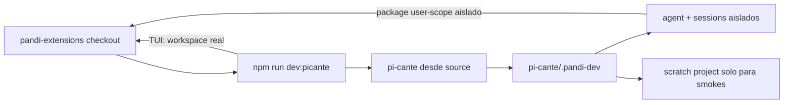

# Configuración — requisitos, capacidades opcionales, configuración y distribución

Esta es la referencia **exhaustiva** de configuración de `pandi-extensions`: reúne requisitos obligatorios y opcionales,
variables de entorno y canales de distribución. Si recién clonaste el repo, mejor empezá por el
[Inicio rápido del README raíz](../README.md#inicio-rápido) y volvé acá cuando necesites un detalle puntual: una
variable, una capacidad opcional o qué canal de distribución conviene.

## En 30 segundos

Hay dos caminos distintos. Para consumir una release estable con Pi vanilla:

```bash
nvm install && nvm use                                             # Node >= 22.19.0
npm install -g --ignore-scripts @earendil-works/pi-coding-agent    # Pi CLI
pi install git:github.com/andrestobelem/pandi-extensions@v0.3.14   # suite fijada para tu usuario
```

Para desarrollar las extensiones, usá checkouts siblings y no instales la suite en tu perfil global:

```bash
git clone https://github.com/andrestobelem/pi-cante.git
git clone https://github.com/andrestobelem/pandi-extensions.git
(cd pi-cante && npm install --ignore-scripts)
(cd pandi-extensions && npm install)
cd pandi-extensions
npm run dev:picante
```

`npm run smoke:picante` verifica el inventario runtime local; `npm run smoke:picante:tui` prueba con tmux el startup,
`/workflows` y `/doctor`. Ninguno llama a un modelo. Usá esta página cuando necesites decidir qué instalar, qué habilita
cada dependencia opcional o cómo se distribuye el paquete.

## Requisitos

### Base

| Requisito             | Para qué sirve                                                                          | Instalación                                            |
| --------------------- | --------------------------------------------------------------------------------------- | ------------------------------------------------------ |
| **Node.js ≥ 22.19.0** | Runtime requerido por `@earendil-works/pi-coding-agent`; el repo fija `22` en `.nvmrc`. | `nvm install 22 && nvm use 22` — o `brew install node` |
| **npm**               | Instala la toolchain de desarrollo y ejecuta `npm test`. Viene con Node.                | (incluido con Node)                                    |
| **git**               | Lo usan `pandi-worktree` y los scouts de workflows.                                     | `xcode-select --install` o `brew install git`          |

> Node 22 es el piso. La extensión opcional Gondolin necesita Node ≥ 23.6.0.

### Según el camino

| Requisito                                      | Cuándo hace falta                                              | Instalación o verificación                                                                     |
| ---------------------------------------------- | -------------------------------------------------------------- | ---------------------------------------------------------------------------------------------- |
| **Pi CLI** (`@earendil-works/pi-coding-agent`) | Solo para consumir o probar la suite con un perfil vanilla Pi. | `npm install -g --ignore-scripts @earendil-works/pi-coding-agent`; verificá con `pi --version` |
| **Checkout sibling de `pi-cante`**             | Para ejecutar extensiones en vivo durante el desarrollo.       | Clonalo junto a este repo y corré allí `npm install --ignore-scripts`.                         |
| **tmux**                                       | Solo para `npm run smoke:picante:tui`.                         | `brew install tmux`; verificá con `tmux -V`.                                                   |

### Opcionales

Cada opción habilita una capacidad; sin ella, esa capacidad simplemente no existe.

| Capacidad                                             | Requisito                                                                          | Instalación                                                                                                                                                                                                                     |
| ----------------------------------------------------- | ---------------------------------------------------------------------------------- | ------------------------------------------------------------------------------------------------------------------------------------------------------------------------------------------------------------------------------- |
| Búsqueda web para subagentes (`web_search`)           | `pi-codex-web-search` incluido en el bundle + CLI `codex`                          | El bundle lo instala; agregá `codex` al sistema para ejecutar búsquedas.                                                                                |
| MCP (`/mcp` y tool `mcp`)                             | `pi-mcp-adapter` incluido en el bundle                                              | El bundle lo instala; configurá servidores en `.mcp.json` o `~/.config/mcp/mcp.json` cuando los necesites.                                             |
| Docs de librerías bajo demanda (Context7)             | Skill `context7-cli` (opcional) + CLI `ctx7`                                       | Configurá Context7 con `npx ctx7 setup --cli` (modo "CLI + Skills"; sucesor de `ctx7 skills install`). `ctx7` es un devDependency: ejecutalo con `npx ctx7` después de `npm install` (o globalmente con `npm i -g ctx7@latest`) |
| Gráficos PNG para `/workflow graph`                   | `@mermaid-js/mermaid-cli` (`mmdc`) + Chrome de Puppeteer                           | Se instala automáticamente con `npm install`; si falla el render: `npx puppeteer browsers install chrome-headless-shell`                                                                                                        |
| Sandboxes Linux (`pandi-container`)                   | Apple `container` (macOS Apple Silicon)                                            | `brew install container && container system kernel set --recommended && container system start`                                                                                                                                 |
| Sandboxes de contenedor restringidos (`pandi-podman`) | Podman                                                                             | macOS: `brew install podman && podman machine init && podman machine start`; Linux: gestor de paquetes de la distribución                                                                                                       |
| Ultracode desde el chat de Cursor                     | Cursor + `cursor-agent` autenticado + `@pandi-coding-agent/pandi-ultracode-cursor` | Instalá el paquete en el proyecto y el plugin local explícito; ver el [README del host](https://github.com/andrestobelem/pandi-extensions/tree/main/extensions/pandi-ultracode-cursor).                                         |
| Runner externo desde Claude Code                      | Claude Code CLI autenticado + `@pandi-coding-agent/pandi-ultracode-claude`         | Cargá el plugin por sesión con `claude --plugin-dir …/claude-plugin`; `/ultracode-run` exige confirmar `--trust-workspace`. `/ultracode` nativo se preserva.                                                                    |
| Ultracode desde Codex CLI                             | Codex CLI autenticado + `@pandi-coding-agent/pandi-ultracode-codex`                | Instalá el paquete en el proyecto y corré el host de terminal; la primera entrega no instala plugins ni toca `~/.codex`.                                                                                                        |
| Aislamiento por micro-VM (Gondolin)                   | `@earendil-works/gondolin` (darwin-arm64 / linux-x64, Node ≥ 23.6.0)               | `npm run setup:gondolin`, después `pi -e .pi/tools/gondolin`                                                                                                                                                                    |

> Toda la toolchain de desarrollo (`biome`, `tsc`, `esbuild`, `markdownlint-cli2`, `prettier`, `ctx7`) vive como
> **devDependencies**; `@mermaid-js/mermaid-cli` es un **optionalDependency** (tiene fallback ASCII, así que una
> descarga fallida de Chromium no rompe la instalación). Todo se instala con `npm install` (los opcionales, salvo
> `--omit=optional`) y se ejecuta con `npm run …`/`npx`, sin instalaciones globales adicionales. El **Pi CLI** global
> corresponde al camino de consumo vanilla; el desarrollo aislado lo ejecuta desde el checkout de `pi-cante`. Para ese
> flujo, verificá el entorno efectivo con `npm run dev:picante -- status` y `npm run smoke:picante`; el doctor directo
> conserva los chequeos del host vanilla.

## Variantes de instalación

### Consumo estable con Pi vanilla

| Variante                        | Comando                                                               | Cuándo                                                       |
| ------------------------------- | --------------------------------------------------------------------- | ------------------------------------------------------------ |
| Suite fijada para tu usuario    | `pi install git:github.com/andrestobelem/pandi-extensions@v0.3.14`    | Usá la suite estable completa en todos tus proyectos.        |
| Suite fijada para un proyecto   | `pi install -l git:github.com/andrestobelem/pandi-extensions@v0.3.14` | Solo ese proyecto debe cargar la suite estable completa.     |
| Extensión npm individual        | `pi install npm:@pandi-coding-agent/pandi-<ext>`                      | Necesitás una capacidad a la carta en tus proyectos.         |
| Entry point local, sin instalar | `pi --no-extensions -e ./extensions/pandi-dynamic-workflows/index.ts` | Smoke puntual de compatibilidad con un Pi vanilla existente. |

Para usar los workflows del proyecto en `.pi/workflows/`, confiá el proyecto con `/trust` y reiniciá o ejecutá
`/reload`.

### Desarrollo del checkout con Picante

Desde `pandi-extensions`, estos comandos delegan al checkout sibling `../pi-cante`:

```bash
npm run dev:picante -- status # inspecciona perfil, bundle y fuentes sin abrir la TUI
npm run smoke:picante         # inventario runtime exacto del manifiesto; sin modelo
npm run smoke:picante:tui     # startup + /workflows + /doctor mediante tmux; sin modelo
npm run dev:picante           # abre la TUI aislada para el loop interactivo
```

Si `pi-cante` vive en otra ruta, usá `PI_CANTE_ROOT=/ruta/a/pi-cante`. El wrapper le pasa automáticamente la ruta de
este repo como `PANDI_EXTENSIONS_ROOT` y `PI_CANTE_DEV_WORKSPACE`.



El perfil `.pandi-dev/` registra este checkout con alcance de usuario **solo dentro de su agent descartable**; no es una
instalación user-wide real. La TUI usa este repo como cwd y guarda su estado Picante en `.picante/` (gitignored). Los
smokes fuerzan el proyecto scratch, el bundle queda deshabilitado y ningún package de `~/.pi` entra en la sesión.
`/doctor` sí puede inspeccionar rutas globales en modo read-only. Es aislamiento de **configuración**, no un sandbox del
sistema operativo; las extensiones conservan los permisos del proceso que lanzó Picante.

### Recursos globales opcionales de Claude Code

El repo no modifica `~/.claude` por defecto. La interfaz es explícita y respeta `CLAUDE_GLOBAL_DIR` (o `--dest`):

```bash
npm run sync:claude:global:status  # read-only; el alias sync:claude:global también solo informa
npm run sync:claude:global:install # instala y registra paths + hashes gestionados
npm run sync:claude:global:remove  # borra solo archivos gestionados que no fueron modificados
```

`install` aborta antes de escribir si encuentra una colisión ajena o modificada. `remove` conserva archivos ajenos y
gestionados modificados, los reporta y devuelve exit distinto de cero; el manifiesto queda para poder reintentarlo.

### Skill externo: karpathy-guidelines

El skill `karpathy-guidelines` **no** viene vendorizado en el repo; `AGENTS.md` espera que esté instalado. Traelo desde
upstream a tus skills globales (Pi lee `~/.agents/skills`, Claude Code `~/.claude/skills`):

```bash
for d in ~/.agents/skills ~/.claude/skills; do
  mkdir -p "$d/karpathy-guidelines"
  curl -fsSL https://raw.githubusercontent.com/multica-ai/andrej-karpathy-skills/main/skills/karpathy-guidelines/SKILL.md \
    -o "$d/karpathy-guidelines/SKILL.md"
done
```

### Skills vendorizados

El paquete `pandi-dynamic-workflows` **vendoriza sus propios skills** (`ultracode`, `deep-research`, `default`) en
`extensions/pandi-dynamic-workflows/skills/`, para que viajen cuando instalás solo esa extensión. Son un espejo generado
del origen canónico en `.pi/skills/` (regenerar con `npm run sync:skills:vendor`; el test de paridad y `npm run doctor`
detectan drift). Dentro del repo no se duplican: la entrada de esa extensión en `.pi/settings.json` filtra `skills: []`
porque el repo ya los carga por auto-discovery desde `.pi/skills/`.

### Personas empaquetadas

El package `pandi-personas` empaqueta las personas advisor (`andrej-karpathy`, `dave-farley`, `kent-beck`, `uncle-bob`)
bajo `extensions/pandi-personas/personas/`, para que viajen cuando instalás esa extensión standalone. La fuente canónica
sigue siendo `.pi/personas/*.json`; el espejo se regenera con `npm run sync:personas:package` y se verifica con
`npm run sync:personas:package:check`.

Pi packages no tiene un recurso nativo `pi.personas`; `pandi-personas` carga una extensión liviana que registra su
directorio de JSONs para que `pandi-dynamic-workflows` los resuelva con `agentType`. Precedencia:
`.pi/personas/<name>.json` del proyecto trusted > persona empaquetada > built-in de `pandi-dynamic-workflows`.

## Capacidades opcionales en detalle

- **Búsqueda web (`web_search`) para subagentes** — `pi-codex-web-search` viaja dentro del bundle completo y de
  Picante. Solo falta el CLI `codex` del sistema (`brew install codex` o `npm install -g @openai/codex`). Si no está en
  `PATH`, apuntalo con `CODEX_PATH`. Exclusión por subagente: `excludeTools: ["web_search"]` o
  `includeExtensions: false`. Si instalás únicamente `pandi-dynamic-workflows`, agregá el paquete externo por separado.

- **MCP (`/mcp` y tool `mcp`)** — `pi-mcp-adapter` también viaja en el bundle completo y Picante. Configurá servidores
  solo cuando los necesites en `.mcp.json` para el proyecto o `~/.config/mcp/mcp.json` para compartirlos; el adaptador
  los conecta de forma lazy. Si instalás una extensión Pandi individual, instalá `pi-mcp-adapter` explícitamente.

- **Context7 (docs de librerías)** — el skill `context7-cli` **no** viene vendorizado en el repo. Configuralo con
  `npx ctx7 setup --cli` (modo "CLI + Skills"; sucesor de `ctx7 skills install`, que deja de funcionar en la próxima
  major). Pi autodetecta el skill desde el scope global (`~/.agents/skills/` o `~/.pi/agent/skills/`) en cualquier
  proyecto y lo agrega a los subagentes. El CLI `ctx7` se distribuye como **devDependency**: ejecutalo con `npx ctx7`
  después de `npm install` (o globalmente con `npm i -g ctx7@latest`). Exclusión por subagente: `includeSkills: false`.
- **Visuales de `/workflow graph`** — `mmdc` se instala automáticamente con `npm install` (`@mermaid-js/mermaid-cli`
  como `optionalDependency`). El PNG inline necesita una terminal con protocolo de imagen
  (Kitty/Ghostty/WezTerm/Warp/iTerm2; Pi lo desactiva bajo `tmux`). Si `mmdc` falla con Chrome/Puppeteer:
  `npx puppeteer browsers install chrome-headless-shell`. Sin `mmdc`: fallback de topología ASCII + exportación Mermaid.
- **Sandboxes Linux (`pandi-container`)** — solo macOS Apple Silicon:
  `brew install container && container system kernel set --recommended && container system start`. En hosts no
  compatibles, la extensión devuelve un mensaje acotado; no crashea.
- **Sandboxes de contenedor restringidos (`pandi-podman`)** — instalá Podman (`brew install podman` en macOS; gestor de
  paquetes de la distribución en Linux). macOS y Windows requieren una VM de Podman: iniciala una vez con
  `podman machine init` y arrancala con `podman machine start` o `/podman machine-start`. La extensión no expone mounts,
  puertos ni privilegios y no es una frontera infalible contra código hostil, especialmente en Linux.
- **Aislamiento Gondolin (micro-VM)** — `npm run setup:gondolin` copia el ejemplo que trae Pi a `.pi/tools/gondolin/`
  (gitignored, no se auto-descubre) e instala sus dependencias con `--ignore-scripts`; cargalo cuando lo necesites con
  `pi -e .pi/tools/gondolin`. Requiere darwin-arm64/linux-x64 y Node ≥ 23.6.0. No aísla los spawns de subagentes de
  dynamic-workflows (ver [`docs/gondolin-isolation.md`](./gondolin-isolation.md)).

## Configuración (variables de entorno)

Todas las extensiones arrancan con valores razonables; no hace falta configurar nada para empezar. Si querés ajustar el
comportamiento, exportá variables de entorno. Una referencia versionada con los overrides más comunes vive en
**`.env.example`**; las extensiones pueden exponer opciones avanzadas junto a su implementación. Las más usadas:

| Variable                          | Extensión      | Default                                            | Propósito                                                                                    |
| --------------------------------- | -------------- | -------------------------------------------------- | -------------------------------------------------------------------------------------------- |
| `PI_DYNAMIC_WORKFLOWS_MAX_DEPTH`  | core           | `2`                                                | Profundidad máxima de anidamiento de workflows; `0` = kill-switch total.                     |
| `PI_DYNAMIC_WORKFLOWS_PI_COMMAND` | core, goal     | binario de la distribución host (`pi` normalmente) | Binario de Pi usado para spawnear subagentes; la variable permite sobrescribirlo.            |
| `PI_AUTO_COMPACT_PERCENT`         | auto-compact   | `35` (`50` en Codex)                               | Porcentaje de contexto que dispara la compactación.                                          |
| `PI_AUTO_COMPACT_FAST_SUMMARY`    | auto-compact   | `on`                                               | Usa un resumen rápido/acotado en `session_before_compact`; cae al compactor nativo si falla. |
| `PI_AUTO_COMPACT_SUMMARY_MODEL`   | auto-compact   | Sonnet 5 (`gpt-5.6-sol` en Codex)                  | Override del modelo de resumen como `provider/model`.                                        |
| `PI_TS_LSP` / `PI_TS_LSP_MODE`    | typescript-lsp | `on` / `advisory`                                  | Habilita feedback de `tsc` y su modo (`advisory`/`autofix`).                                 |
| `PI_PODMAN_TIMEOUT_MS`            | pandi-podman   | `120000`                                           | Timeout de llamadas a Podman; subilo para pulls o comandos legítimamente largos.             |
| `PI_PLAN_NONINTERACTIVE`          | plan           | (off)                                              | Permite el modo plan en print/json (subagentes).                                             |
| `CODEX_PATH`                      | web-search     | (PATH)                                             | Ruta al binario `codex` cuando no está en el `PATH`.                                         |

`.env` está gitignored; `.env.example` está committed. Este repo no carga `.env` automáticamente: exportá las variables
en tu shell o usá `direnv`/`dotenvx`.

## Distribución: canales y regla de identidad única

En un perfil vanilla Pi, **elegí un solo canal por máquina o alcance**. Pi deduplica packages por identidad (nombre npm,
URL git o ruta local resuelta), no por los comandos que registran; dos canales distintos pueden cargar los mismos
recursos dos veces. `npm run doctor` lo detecta y avisa.

| Canal                                     | Cómo                                                                                                | Cuándo                                                                                                                                                                                                             |
| ----------------------------------------- | --------------------------------------------------------------------------------------------------- | ------------------------------------------------------------------------------------------------------------------------------------------------------------------------------------------------------------------ |
| **Bundle git fijado**                     | `pi install git:github.com/andrestobelem/pandi-extensions@v0.3.14`                                  | Consumo user-wide de toda la suite, con versión estable.                                                                                                                                                           |
| **Working tree con Picante**              | clone sibling + `npm run dev:picante`                                                               | Desarrollo normal: perfil descartable, bundle deshabilitado y checkout local como fuente única.                                                                                                                    |
| **Working tree con Pi vanilla**           | clone + `pi install -l ./` en un proyecto scratch                                                   | Smoke específico de compatibilidad con instalación local; no es el loop normal de contribución.                                                                                                                    |
| **npm con scope `@pandi-coding-agent/*`** | `pi install npm:@pandi-coding-agent/pandi-<ext>`                                                    | A la carta y user-wide — los paquetes publican bajo la identidad `pandi-*`. Con `min-release-age`, las versiones recién publicadas recién se pueden instalar después de esa ventana.                               |
| **Host Cursor local**                     | `npm install -D @pandi-coding-agent/pandi-ultracode-cursor` + symlink de plugin                     | El host autónomo no se instala con `pi install`; seguí el [README del paquete](https://github.com/andrestobelem/pandi-extensions/tree/main/extensions/pandi-ultracode-cursor) para activar `/ultracode` en Cursor. |
| **Host Claude externo**                   | `npm install -D @pandi-coding-agent/pandi-ultracode-claude` + `claude --plugin-dir …/claude-plugin` | Carga `/ultracode-run` solo para la sesión actual; el runner exige `--trust-workspace` y no reemplaza `/ultracode` nativo.                                                                                         |
| **Host Codex local**                      | `npm install -D @pandi-coding-agent/pandi-ultracode-codex`                                          | Host de terminal; no instala plugins ni modifica `~/.codex`.                                                                                                                                                       |

Picante registra la ruta local como package user-scope dentro de `.pandi-dev/agent` y fuerza `PI_BUNDLED_PACKAGES=0`,
por lo que la suite bundled no compite con el checkout. Ese alcance de usuario termina en el perfil descartable: los
packages configurados en `~/.pi` no entran en esa sesión.

Cada `extensions/pandi-<ext>/package.json` lleva su identidad pública `@pandi-coding-agent/pandi-<ext>` (npm workspaces;
`npm pack -w @pandi-coding-agent/pandi-<ext>` para probar el tarball). El manifiesto raíz de `pi` se **genera** desde
los subpackages (`npm run sync:manifest`); un test de paridad falla si hay drift. Horizonte: **Pandi** como distro sobre
Pi (extensiones + theme + persona), no como un fork del CLI.

### Fuentes canónicas y syncs generados

Regla simple: editá la fuente canónica, no el mirror generado. `npm run doctor` verifica estos dominios en modo
read-only y muestra el comando de arreglo cuando detecta drift.

| Dominio                           | Fuente canónica                                                 | Artifact/mirror generado                         | Check                                 | Fix seguro                      |
| --------------------------------- | --------------------------------------------------------------- | ------------------------------------------------ | ------------------------------------- | ------------------------------- |
| Manifest raíz de Pi               | `extensions/pandi*/package.json` (`pi.extensions`, `pi.themes`) | `package.json#pi`                                | `npm run sync:manifest:check`         | `npm run sync:manifest`         |
| Settings del repo                 | Los mismos manifests de subpackages                             | `.pi/settings.json`, `.pi/settings.json.example` | `npm run sync:settings:check`         | `npm run sync:settings`         |
| Skill mirrors Pi↔Claude           | `.pi/skills/<name>/SKILL.md` clasificado como `mirrored`        | `.claude/skills/<name>/SKILL.md`                 | `npm run sync:skills:check`           | `npm run sync:skills`           |
| Skills vendorizados por extensión | `.pi/skills/<name>/` clasificado como `vendoredBy`              | `extensions/<ext>/skills/<name>/`                | `npm run sync:skills:vendor:check`    | `npm run sync:skills:vendor`    |
| Guía para agentes                 | `AGENTS.md`                                                     | `CLAUDE.md`                                      | `npm run sync:agents:check`           | `npm run sync:agents`           |
| Skills Claude de ultracode        | `.pi/skills/ultracode/`                                         | `.claude/skills/{ultracode,dynamic-workflows}/`  | `npm run sync:claude:ultracode:check` | `npm run sync:claude:ultracode` |
| Docs HTML                         | `README.md`, `docs/**/*.md`                                     | `docs/html/**`                                   | `npm run sync:docs:html:check`        | `npm run sync:docs:html`        |
| Personas README                   | `.pi/personas/*.json`                                           | `.pi/personas/README.md` y HTML                  | `npm run sync:personas:check`         | `npm run sync:personas`         |
| Personas empaquetadas             | `.pi/personas/*.json`                                           | `extensions/pandi-personas/personas/*.json`      | `npm run sync:personas:package:check` | `npm run sync:personas:package` |

En los aliases generados, el cuerpo puede ser byte-idéntico y el frontmatter variar por modo de invocación: `ultracode`
queda model-invoked y `dynamic-workflows`, manual. Entre los skills Pi, `default` también es manual.

Los fixes de la tabla son locales, idempotentes y commiteables. Estado global del usuario (por ejemplo `~/.claude` o
instalaciones Pi globales) se reporta como diagnóstico/propose-only: `doctor` te dice qué correr, pero no lo muta por
vos.

## Estructura del repositorio (extensiones)

Cada extensión vive como un mini paquete npm bajo `extensions/<name>/`:

```text
extensions/<name>/
  index.ts              # entrypoint de Pi
  *.ts                  # helpers de runtime de esa extensión
  tests/unit/           # tests rápidos, cuando aplica
  tests/integration/    # suites durables de comportamiento
```

`package.json` publica solo archivos de runtime con `files: ["extensions/*/*.ts", ...]`, así que los tests quedan cerca
del código pero fuera del tarball npm. `pi.extensions` lista explícitamente los entrypoints cargados por defecto; las
extensiones opcionales pueden seguir el mismo patrón y cargarse desde settings.

`extensions/pandi-local-memory/` carga la carpeta `.pi/memory/` cuando existe (inyecta el índice `MEMORY.md` con tope de
200 líneas/25 KB y lista archivos temáticos para lectura bajo demanda; cae al viejo `.pi/MEMORY.md`). La extensión viene
con el paquete; el contenido de memoria queda privado y gitignored.

## Troubleshooting

- **Un comando no aparece en el perfil Picante** — corré `npm run dev:picante -- status` y después
  `npm run smoke:picante`; ambos deben señalar este checkout como fuente única. Los workflows con alcance de proyecto
  están protegidos por trust, pero `.pandi-dev/project` se aprueba automáticamente para los smokes.
- **No se encuentra `../pi-cante`** — clonalo como sibling o ejecutá con
  `PI_CANTE_ROOT=/ruta/a/pi-cante npm run dev:picante`.
- **`tmux` no se encuentra** — solo bloquea `npm run smoke:picante:tui`; instalalo y verificá `tmux -V`. El smoke RPC y
  la TUI interactiva no dependen de tmux.
- **`pi` no se encuentra en el camino vanilla** — la instalación global (ver Requisitos) no terminó, o el binario global
  de npm no está en `PATH`. El desarrollo con Picante no usa ese binario.
- **Node demasiado viejo** — corré `nvm use` (necesitás ≥ 22.19.0; Gondolin necesita ≥ 23.6.0). `npm run doctor` sale
  con código distinto de cero en un Node viejo, pero el repo no declara campo `engines`, así que un `npm install` normal
  no te bloquea.
- **Parece que el mismo recurso se carga dos veces** — probablemente mezclaste dos canales de distribución (ver
  "Distribución" arriba); `npm run doctor` lo detecta y avisa en un perfil vanilla. El perfil `.pandi-dev` deshabilita
  el bundle y excluye packages globales por diseño.
- **Cualquier otra cosa** — `npm run doctor` es de solo lectura y diagnostica el host vanilla. Dentro del flujo Picante,
  usá `npm run dev:picante -- status`, `npm run smoke:picante` y `/doctor`: esos comandos reciben las rutas efectivas
  del perfil aislado.
