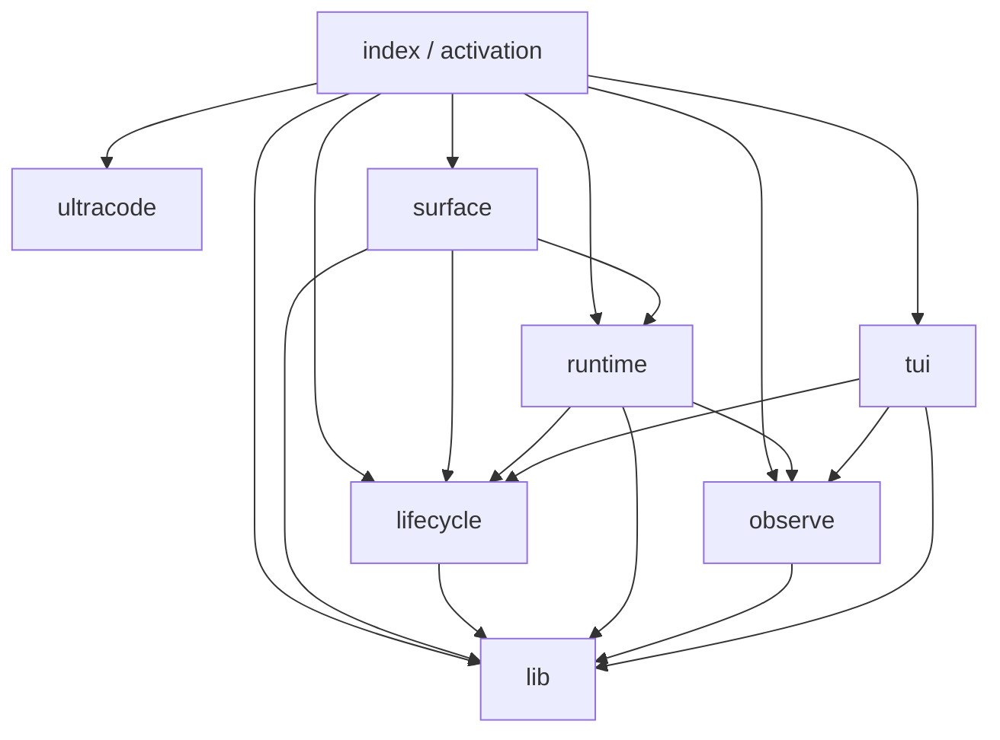

# Arquitectura — deep modules

En 30 segundos: `pandi-dynamic-workflows` se organiza en **pocos módulos profundos** (interfaz chica, mucha complejidad escondida). Los extracts flat del refactor bottom-up viven *dentro* de esos módulos; el resto del paquete solo importa la fachada (`index.ts` de cada carpeta).

## Mapa

| Módulo | Carpeta | Fachada (lo que el resto ve) | Esconde |
| --- | --- | --- | --- |
| **lib** | `lib/` | format, concurrency, path safety, notify, presentation, … | helpers transversales puros (sin activación) |
| **runtime** | `runtime/` | `runWorkflow`, `WorkflowRuntimeApi` | engine, make-api, subagent, agents/race, journal, host, worker |
| **lifecycle** | `lifecycle/` | start / resume / cancel / delete / cleanup / notify / registry | start, resume, cleanup, notify, reload-handoff |
| **surface** | `surface/` | resolve, preflight, transform, tool + slash commands | resolve, scaffolds, tool-handler, command-browse/lifecycle |
| **observe** | `observe/` | `collectRunReport`, `writeRunReport`, `readRunEvents` | report html/md/io, event parse/read, focus metrics; **Mermaid del report** |
| **tui** | `tui/` | `openWorkflowDashboard`, `showLiveAgentView`, `showWorkflowGraph` | dashboard, agent-view, **graph interactivo** (`tui/graph/`) |
| **ultracode** | `ultracode/` | register* + extractUltracodeTask | router, mode, toggles, input events, runtime state |

Raíz del paquete: `index.ts` (activación), `types.ts` (contratos), `ARCHITECTURE.md`, y fachadas de activación (`workflow-public-api.ts`, `workflow-extension-activation.ts`, …). Helpers transversales viven en `lib/`.

**Dependency Rule:** activation/surface → deep modules; `runtime` no importa `tui` ni comandos. `ultracode` no conoce el interior de `runtime` (solo tool availability / prompts).

## Decisiones de naming

1. **Carpetas en inglés, nombres cortos** (`runtime`, no `workflow-runtime`). El prefijo `workflow-` / `ultracode-` / `run-` se **tira al entrar** a la carpeta (`ultracode/router.ts`, no `ultracode/ultracode.ts`).
2. **Fachada = `index.ts`** por deep module. Call sites externos importan `./ultracode/index.js` (o el path estable documentado), no archivos hoja.
3. **Ultracode queda dentro del paquete** (deep module), no extensión hermana: comparte tool `dynamic_workflow`, sesión y status UI; separarlo rompería el producto sin ganar un límite de deploy real.
4. **Graph partido con inteligencia, sin dedupe:**
   - Interactivo / TUI → `tui/graph/`
   - Mermaid del HTML report → `observe/` (`observe/html-mermaid.ts`)
   - Never-touch: no unificar renderers TUI↔HTML.
5. **Tests espejo:** `tests/integration/<módulo>/…` con el mismo vocabulario. El prefijo de archivo se acorta dentro de la carpeta (`ultracode/border-status.test.mjs`). Suites transversales (parity, doctor, boundaries) viven en `tests/integration/guards/`.

## Never-touch (sigue vigente)

- Semántica FIFO / autopilot de loop
- Contrato de seguridad HTML del run-report (CDN/SRI/sandbox Mermaid)
- Dedupe Mermaid/TUI ↔ HTML
- Parsers bash plan ↔ worktree
- `PLAN_MODE_GUARD_SYMBOL`

## Migración

1. Doc + discovery recursivo de suites + `files` del package — hecho.
2. Un deep module por commit atómico (código + tests + imports): `ultracode/` → `lifecycle/` → `observe/` (hecho) → `tui/` (hecho) → `surface/` (hecho) → `runtime/` (hecho) → `lib/` (hecho).
3. Achicar `workflow-public-api.ts` a reexports de fachadas — hecho (solo fachadas + types + lib file-append vía `./lib/index.js`).
4. Mover transversales a `lib/` — hecho; raíz limpia (activación + contratos).
5. Polish post-migración — hecho: imports de `formatRunSummary` desde `lib/`, suites planas reubicadas bajo `tests/integration/<módulo>/` y `guards/`.

Condición de stop por paso: `npm run typecheck` + suites del módulo en verde; sin cambio de comportamiento.

## Post-migración / deuda conocida

- **lifecycle / surface → tui (UI ops):** arranque, comandos slash y la tool `dynamic_workflow` siguen llamando a tui para dashboard, status widget y `runWorkflowWithUi`. Listado/resolución de runs (`listRuns`, `resolveRun`, `selectRunByKey`, `formatRunList`) vive en `runtime/runs.ts`; lifecycle inventory/cleanup/resume ya no importan tui para eso. El acoplamiento lifecycle→tui restante es status widget + `runWorkflowWithUi` únicamente.
- **runtime/snapshots y surface/preflight → tui/graph/model:** el model builder depende de `surface/resolve` (`resolveWorkflow`). Moverlo a `lib/` crearía `lib → surface`; hasta tener un resolver inyectable, el acoplamiento queda documentado en `runtime/snapshots.ts`.
- **Tests:** no quedan suites planas bajo `tests/integration/*.test.mjs`; las 19 restantes se movieron a carpetas espejo (`runtime/`, `surface/`, `tui/`, `observe/`, `guards/`). `fixtures/` y `worker-source-test-support.mjs` permanecen en la raíz de integración como soporte.
