# pi-dynamic-workflows-core

Individual Pi package for the core Dynamic Workflows extension.

## Install

From this repository:

```bash
pi install ./extensions/pi-dynamic-workflows
pi install -l ./extensions/pi-dynamic-workflows
pi --no-extensions -e ./extensions/pi-dynamic-workflows
```

## Provides

- `dynamic_workflow` model tool for listing, templating, reading, writing, running, resuming, cancelling, graphing, and viewing workflows.
- `/workflow` and `/workflows` human commands.
- `/ultracode`, `/deep-research`, `/ultracode-mode`, and `/ultracode-phase0` routing commands.
- Ultracode Phase 0 guidance for a small read-only adversarial prompt-engineering workflow before broad scout/orchestration; disable it per session with `/ultracode-phase0 off`.
- Compact Claude-style template catalog: six primary templates, compose templates, and use-case templates, with no pattern aliases.
- JavaScript workflow runtime with `ctx.agent`, `ctx.agents`, `ctx.pipeline`, `ctx.parallel`, `ctx.workflow`, artifacts, resumable journal, and TUI dashboard.

## Catálogo de patrones

Antes de escribir un workflow, usa `dynamic_workflow action=template` o
`/workflow new <name> --pattern=<key>` para inspeccionar el scaffold más cercano.
Los patrones son piezas de diseño: elige el más simple que produzca evidencia,
registra límites/caps y deja artifacts verificables.

Guía rápida de elección:

- No uses Dynamic Workflows para una pregunta simple, una edición de un archivo o
  una tarea que cabe en pocos tool calls directos.
- Usa **fan-out** cuando hay ramas independientes; **classify-and-act** cuando
  primero necesitas separar riesgo/señal; **adversarial verification** cuando ya
  tienes claims y quieres podarlos; **loop-until-done** cuando el tamaño real del
  trabajo es desconocido.
- Los intents legacy siguen siendo rutas: `deep-research` apunta a
  `complex-research` y `default` apunta a `fan-out-and-synthesize`.

### `classify-and-act` — clasificar y actuar

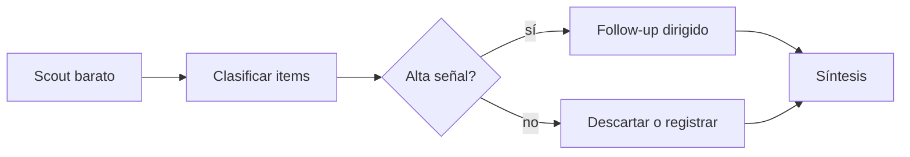

- **Uso:** muchos items necesitan tratamientos distintos después de una
  clasificación barata.
- **Elígelo cuando:** una auditoría, review de PR o migración solo debe gastar
  agentes caros en archivos de riesgo medio/alto.
- **Primitivas:** `ctx.bash`, `ctx.pipeline`, `ctx.agent(schema)`.
- **Verifica:** artifact con clasificación completa, conteo de items omitidos y
  evidencia de cada follow-up.

### `fan-out-and-synthesize` — abrir en paralelo y sintetizar

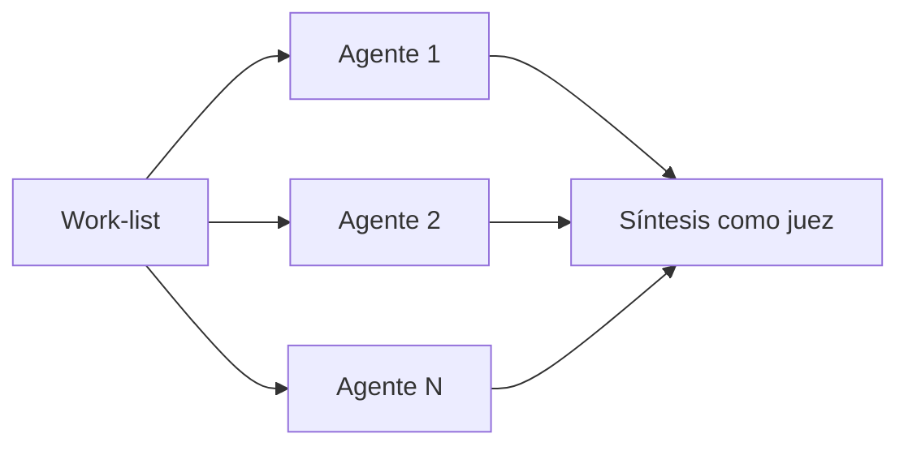

- **Uso:** trabajo independiente con una reducción final.
- **Elígelo cuando:** puedes dividir por archivos, temas, módulos o perspectivas
  y necesitas una síntesis que descarte hallazgos sin evidencia.
- **Primitivas:** `ctx.bash`, `ctx.agents({ settle:true })`, `ctx.agent`.
- **Verifica:** reporta cobertura, ramas fallidas, caps y hallazgos con citas.

### `adversarial-verification` — verificación adversarial

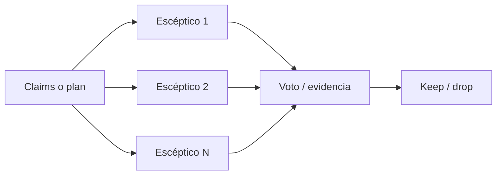

- **Uso:** podar claims, bugs sospechados o planes antes de actuar.
- **Elígelo cuando:** el coste de aceptar un falso positivo es alto.
- **Primitivas:** `ctx.parallel`, `ctx.agent(schema)`, voting.
- **Verifica:** cada claim queda en `verified` o `dropped` con razón y evidencia.

### `generate-and-filter` — generar opciones y filtrar

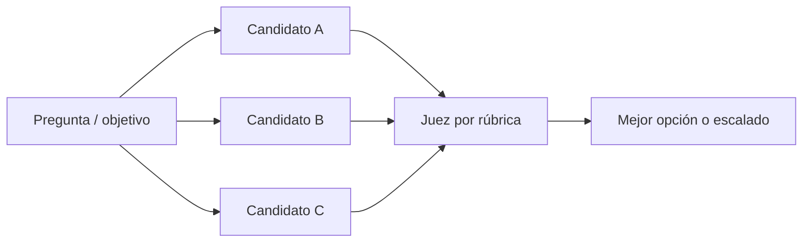

- **Uso:** diseñar varias soluciones y elegir por una rúbrica explícita.
- **Elígelo cuando:** necesitas best-of-N para arquitectura, prompts o estrategia,
  no una única respuesta generada.
- **Primitivas:** `ctx.parallel`, `ctx.agent(schema)`, bucle adaptativo.
- **Verifica:** guarda candidatos, rúbrica, puntuación y motivo de descarte.

### `tournaments` — ranking por torneo

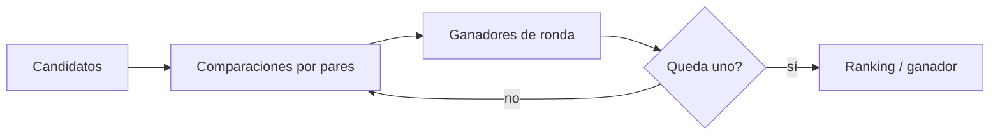

- **Uso:** comparar alternativas cuando el ranking relativo importa más que una
  puntuación absoluta.
- **Elígelo cuando:** hay diseños, prompts o planes que deben competir cara a cara.
- **Primitivas:** `ctx.agents({ settle:true })`, `ctx.agent(schema)`, bracket.
- **Verifica:** conserva matriz/llaves, criterios de comparación y explicación del ganador.

### `loop-until-done` — iterar hasta terminar

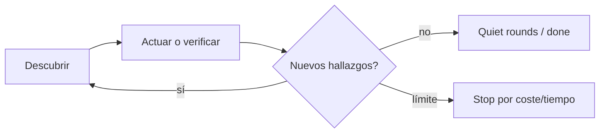

- **Uso:** discovery o repair cuando no conoces el tamaño real del trabajo.
- **Elígelo cuando:** debes repetir hasta rondas quietas, `maxRounds`, budget o timeout.
- **Primitivas:** `ctx.agents({ settle:true })`, loop, `ctx.log`.
- **Verifica:** log de rondas, criterio de parada y lista deduplicada de hallazgos.

### `compose-verify-claims` — componer verificación reutilizable

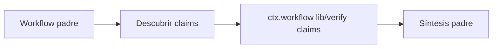

- **Uso:** combinar descubrimiento local con una librería de verificación estable.
- **Elígelo cuando:** no necesitas una decisión humana entre descubrir y verificar.
- **Primitivas:** `ctx.workflow`, `ctx.agent`, sub-workflow.
- **Verifica:** contrato JSON serializable entre padre e hijo y artifacts de ambos.

### `lib-verify-claims` — librería para verificar claims

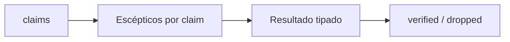

- **Uso:** sub-workflow compartido para fact-checking o pruning de claims.
- **Elígelo cuando:** varios workflows necesitan la misma verificación sin copiar prompts.
- **Primitivas:** `ctx.agents({ settle:true })`, `ctx.agent(schema)`, contrato de librería.
- **Verifica:** entrada `{ claims, skeptics? }`, salida estable y manejo explícito de fallos.

### `workflow-factory` — meta-workflow de diseño

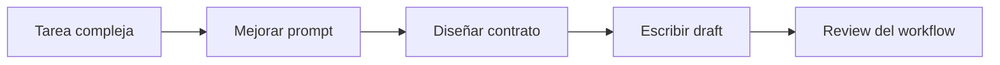

- **Uso:** crear un workflow específico cuando el diseño de prompts/contratos también
  merece revisión.
- **Elígelo cuando:** la orquestación es compleja antes de gastar muchos subagentes.
- **Primitivas:** `ctx.agent(schema)`, prompt improvement, `ctx.writeFile`.
- **Verifica:** draft bajo `.pi/workflows/drafts/`, review y artifacts de decisión.

### `bug-hunt-repo-audit` — auditoría de bugs en repo

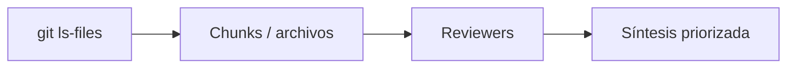

- **Uso:** encontrar bugs probables a través de muchos archivos.
- **Elígelo cuando:** quieres un audit broad reutilizable, no un one-off manual.
- **Primitivas:** `ctx.bash`, `ctx.agents({ settle:true })`, reviewer synthesis.
- **Verifica:** cobertura de archivos, hallazgos priorizados y citas archivo/línea.

### `large-migration` — migración grande

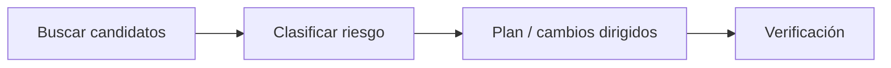

- **Uso:** planear o ejecutar migraciones que cruzan muchos archivos.
- **Elígelo cuando:** debes descubrir blockers, riesgos y caps antes de editar.
- **Primitivas:** `ctx.bash`, `ctx.pipeline`, `ctx.agent(schema)`.
- **Verifica:** inventario de candidatos, clasificación de riesgo y checklist de migración.

### `complex-research` — investigación compleja

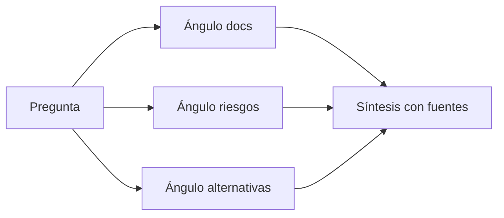

- **Uso:** investigación amplia con fuentes, comparativas o análisis de migración.
- **Elígelo cuando:** necesitas perspectivas independientes y citas, no una respuesta rápida.
- **Primitivas:** `ctx.agents({ settle:true })`, research angles, synthesis-as-judge.
- **Verifica:** fuentes por claim, cobertura de ángulos y límites de investigación.

### `plan-review` — revisión de plan

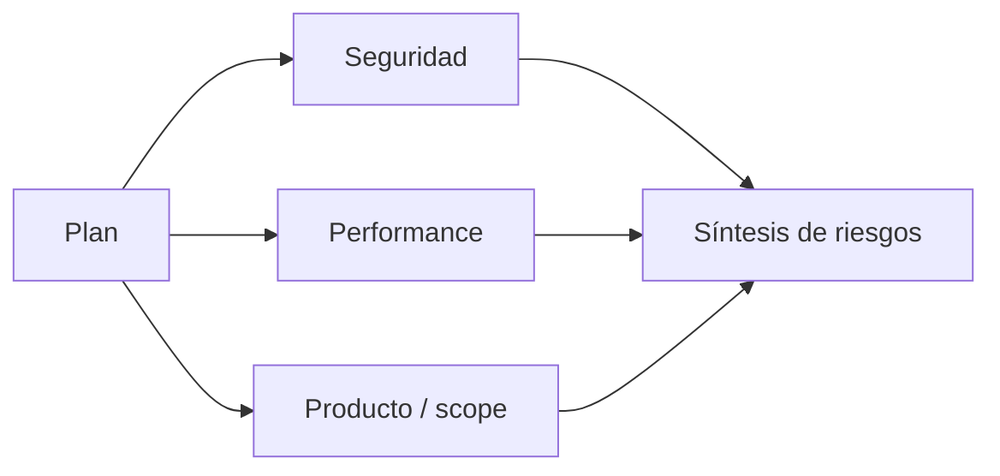

- **Uso:** panel escéptico antes de implementar una decisión riesgosa.
- **Elígelo cuando:** un plan necesita críticas desde varias perspectivas.
- **Primitivas:** `ctx.agents({ settle:true })`, reviewer panel, synthesis-as-judge.
- **Verifica:** riesgos aceptados, cambios recomendados y huecos de verificación.

### `claim-bug-verification` — verificar bugs o claims

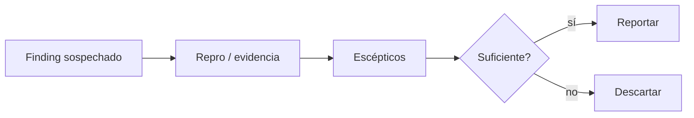

- **Uso:** confirmar hallazgos de un sweep antes de reportarlos o cambiar código.
- **Elígelo cuando:** tienes una lista de bugs/claims sospechosos y quieres separar
  evidencia real de alucinaciones.
- **Primitivas:** `ctx.parallel`, `ctx.agent(schema)`, voting.
- **Verifica:** cada finding tiene repro, evidencia concreta o razón de descarte.

## Research-backed templates

Map common agent papers/frameworks to Pi workflow design:

- **ReAct** -> scout/observe with tools before fan-out; keep reasoning tied to evidence.
- **Self-consistency** -> sample independent branches, then select by consistency/evidence rather than trusting one path.
- **Reflexion / Self-Refine** -> generate -> critique -> refine loops, always bounded by rounds, quiet stops, `maxAgents`, and timeout.
- **Tree of Thoughts** -> branch alternatives, evaluate/prune with a judge, then commit to one path.
- **Multiagent debate** -> adversarial reviewers plus synthesis-as-judge; unsupported claims are dropped.
- **AutoGen / CAMEL / MetaGPT** -> explicit roles, stable artifacts, and clear handoff contracts.
- **SWE-agent / DSPy** -> interface and contracts matter: narrow tools, schemas/fixed formats, and reproducible checks.

Use these as patterns, not ceremony: every branch needs a reason, a contract, and a stop condition.

Stable workflows live in `.pi/workflows/`; drafts and run artifacts live under `.pi/workflows/drafts/` and `.pi/workflows/runs/` for trusted projects.

For `/effort ultracode`, also install `./extensions/pi-effort` or the repository root bundle.
